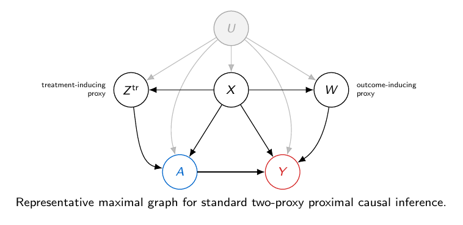
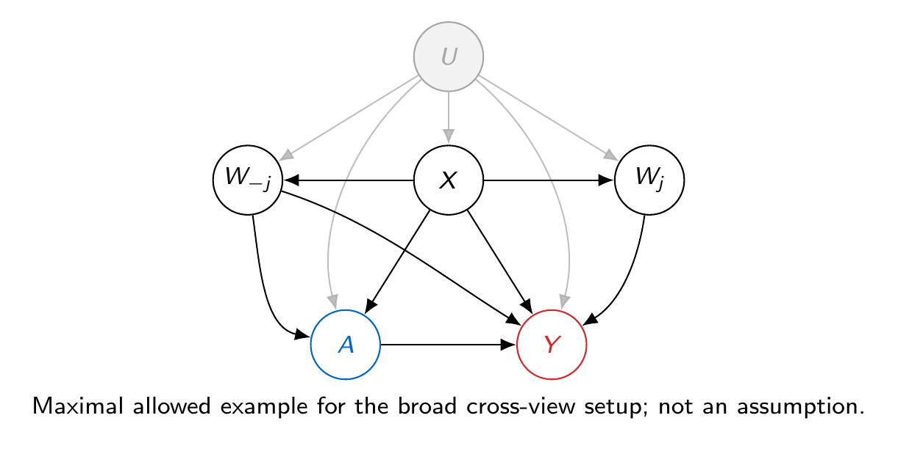

# PROBE: PROxy Blockwise Exclusion for Proximal Balancing

Date: 2026-08-27

Source provenance: Zotero was checked first. Primary publication pages and author-provided preprints were then used to resolve incomplete Zotero results, especially for the recent single-proxy literature.

## Motivation

### Why proxies matter under hidden confounding

An observational study compares outcomes among units who chose, received, or were assigned different treatments outside a randomized experiment. Let $A\in\{0,1\}$ denote a binary treatment and let $Y$ denote the outcome observed after treatment. The difference between the treated and untreated outcome means need not be causal. A pretreatment variable that affects both treatment selection and the outcome can create an association even when treatment itself has no effect.

Some pretreatment variables are observed. We collect them in $X$. Others may remain unobserved. We use $U$ for the hidden pretreatment information that can affect both $A$ and $Y$. Ordinary adjustment can fail when $U$ remains associated with treatment after conditioning on $X$.

Many modern datasets contain an additional high-dimensional pretreatment measurement, called a proxy. We denote this measurement by $W$. Examples include repeated measurements, multiple sensor channels, laboratory panels, and different regions of a medical image. The proxy may carry information about $U$ even when it is not itself a complete adjustment set. Proximal causal inference asks which structural relationships between the proxy, hidden information, treatment, and outcome make causal recovery possible despite hidden confounding. A generic correlation between $W$ and $U$ is not sufficient. Identification requires explicit proxy restrictions and an operator condition that prevents outcome-relevant hidden information from disappearing through the proxy measurement.

### Why PROBE takes a different operational route

We call the proposed method **PROxy Blockwise Exclusion (PROBE)**. PROBE is designed for a high-dimensional candidate proxy that can be divided into scientifically meaningful blocks. It withholds one block, uses the remaining blocks later to construct a low-dimensional adjustment score, and uses the withheld block as a probe of residual treatment imbalance. Because the withheld block is not an input to the score, the score cannot achieve perfect balance merely by copying that block.

PROBE combines ideas that appear separately in adjacent literatures, but its operational route is different. Standard two-proxy proximal inference assigns treatment-inducing and outcome-inducing proxy roles and solves a bridge equation. The Single Proxy Control framework known as COCA uses a negative-control outcome as a proxy for the untreated potential outcome. Xu and Gretton use deterministic outcome generation to make the observed outcome serve as a missing proxy. Single Proxy Identifiability of Causal Effects (SPICE) uses an externally known proxy measurement mechanism. PROBE instead learns conditional balance through blockwise exclusion and then uses ordinary causal adjustment, subject to structural assumptions that will be introduced after the problem setting. When exact balance is unattainable, the same observable discrepancy can support a sensitivity analysis only after an additional quantitative stability condition is supplied.

## Related Work and Our Delta

### Ordinary balancing and causal representation learning

The propensity score compresses observed covariates into the treatment probability $P(A=1\mid X)$. Treatment ignorability given $X$ means that, after the value of $X$ is fixed, treatment assignment is unrelated to the outcomes that would occur under either treatment. Treatment positivity means that both treatment levels remain possible at the relevant values of $X$. Under these conditions, conditioning on the propensity score balances $X$ and permits causal adjustment. Covariate-balancing methods target this observed balance directly. Causal representation-learning methods extend the same idea to high-dimensional $X$ by learning a lower-dimensional representation and penalizing a numerical distance between treatment-group distributions. For example, [Shalit, Johansson, and Sontag (2017)](https://proceedings.mlr.press/v70/shalit17a.html) use a class of such distances called integral probability metrics to connect representation balance to counterfactual prediction error.

These methods motivate representation learning and balance optimization, but their usual causal guarantees still require the measured covariates to control confounding. A small observed discrepancy is not, by itself, a solution to unmeasured confounding. Our project asks what additional proxy structure can give a learned balance objective a causal interpretation when ignorability given $X$ is not assumed.

### Foundational standard two-proxy proximal inference

Standard proximal causal inference allows an unobserved confounder and asks the analyst to scientifically designate two proxy roles. A treatment-inducing proxy, denoted here by $Z^{\mathrm{prox}}$, may affect treatment but is excluded from directly affecting the outcome. An outcome-inducing proxy, denoted by $W^{\mathrm{prox}}$, may affect the outcome but is excluded from directly affecting treatment. Conditional-independence restrictions formalize these roles after the hidden confounder and observed covariates are fixed.

An outcome bridge $h$ is then defined through an observable conditional-moment equation such as

$$
\mathbb E(Y\mid Z^{\mathrm{prox}},A,X)
=
\mathbb E\{h(W^{\mathrm{prox}},A,X)\mid Z^{\mathrm{prox}},A,X\}.
$$

Bridge existence is a range condition for a conditional-expectation operator. Completeness supplies the injectivity needed to transfer the observable bridge relation to the hidden confounder. The resulting proximal g-formula identifies the population average treatment effect (ATE). The foundational point-treatment result is [Miao, Geng, and Tchetgen Tchetgen (2018)](https://doi.org/10.1093/biomet/asy038), and [Tchetgen Tchetgen et al. (2024)](https://doi.org/10.1214/23-STS911) provide a broader introduction.

**Representative standard two-proxy proximal graph.** The treatment-inducing proxy $Z^{\mathrm{prox}}$ may affect $A$ but not $Y$, while the outcome-inducing proxy $W^{\mathrm{prox}}$ may affect $Y$ but not $A$. The graph illustrates the proxy roles but does not by itself establish bridge existence or completeness.

### Estimation, inference, and scope extensions of proximal inference

After the foundational identification results, a substantial literature developed estimators for bridge equations. [Mastouri et al. (2021)](https://proceedings.mlr.press/v139/mastouri21a.html) propose Kernel Proxy Variable estimation based on two-stage regression and Proxy Maximum Moment Restriction based on an unconditional moment problem. Both use reproducing kernel Hilbert space regularization to address the Fredholm inverse problem. [Ghassami et al. (2022)](https://proceedings.mlr.press/v151/ghassami22a.html) develop minimax kernel learning for doubly robust functionals with nuisance functions that solve integral equations, connecting nuisance rates to asymptotic linearity of the final estimator.

A second line develops semiparametric inference and heterogeneous-effect estimation. [Cui et al. (2024)](https://doi.org/10.1080/01621459.2023.2191817) establish efficiency bounds and proximal doubly robust and locally efficient estimators for the ATE. [Sverdrup and Cui (2023)](https://proceedings.mlr.press/v202/sverdrup23a.html) introduce the P-learner for conditional average treatment effects, using a two-stage loss that can be implemented with standard machine-learning tools.

A third line extends the scope of proximal reasoning. [Ying et al. (2023)](https://doi.org/10.1093/jrsssb/qkad020) study longitudinal treatments with time-varying proxies and doubly robust estimation. [Ghassami et al. (2025)](https://doi.org/10.1093/biomet/asae037) study hidden mediators, a hidden front-door criterion, and population intervention indirect effects. [Liu, Tchetgen Tchetgen, and Varjão (2024)](https://proceedings.mlr.press/v238/liu24a.html) use proximal moment restrictions and generalized method of moments estimation for synthetic control, targeting the average treatment effect among treated units in settings with one treated unit.

These developments make the comparison with PROBE precise. Standard proximal methods estimate bridge-related nuisance functions and then evaluate a proximal causal functional. PROBE instead learns a low-dimensional adjustment variable and, under additional structure, uses ordinary adjustment or augmented inverse probability weighted (AIPW) estimation after the variable has been selected. This is a computational and modeling tradeoff, not a claim that the inverse problem has disappeared.

### Single-proxy path I: Single Proxy Control

[Park, Richardson, and Tchetgen Tchetgen (2024)](https://doi.org/10.1093/biomtc/ujae027) use one negative-control outcome $W$ as a proxy for the untreated potential outcome $Y(0)$. Their graph-based analysis and single-world intervention graph (SWIG) formulation motivate a shielding restriction that separates treatment from the negative-control outcome once $Y(0)$ and the observed covariates are fixed. Their load-bearing shielding condition is

$$
W
\perp\!\!\!\perp
A
\mid
\{Y(0),X\}.
$$

The condition says that once the untreated potential outcome and observed covariates are fixed, the negative-control outcome carries no further information about treatment selection. For a possible covariate value $x$ and outcome value $y$, a bridge formulation seeks a function $b$ satisfying

$$
y
=
\mathbb E\{b(W,X)\mid Y=y,X=x,A=0\}.
$$

Among untreated units, the observed outcome equals the untreated potential outcome, which makes this calibration equation observable. COCA also offers an extended-propensity-score route and a doubly robust estimator. Its main nonparametric target is the effect of treatment on the treated (ETT), equivalently the average treatment effect among treated units (ATT). Population ATE identification generally requires additional structure. COCA needs only one negative-control outcome, but its proxy interpretation is specific to $Y(0)$ and its shielding condition is not generally testable.

### Single-proxy path II: deterministic outcomes in Xu and Gretton

[Xu and Gretton (2025)](https://proceedings.mlr.press/v258/xu25g.html) observe treatment $A$, outcome $Y$, and one proxy $W$, while the confounder $U$ remains hidden. Their proxy condition is

$$
W
\perp\!\!\!\perp
(A,Y)
\mid
U.
$$

They also require the proxy to be complete. For a square-integrable function $l$, their condition includes

$$
\mathbb E\{l(U)\mid A=a,W=w\}=0
\quad\text{for every }w
\quad\Longrightarrow\quad
l(U)=0
\text{ almost surely}.
$$

The distinctive identifying resource is deterministic outcome generation:

$$
Y=\gamma_0(A,U).
$$

Once treatment is fixed, the observed outcome is therefore a deterministic transformation of the hidden state. This lets the observed $Y$ play the treatment-proxy role that is missing from a one-proxy dataset. For a treatment value $a$ and outcome value $y$, they seek a bridge satisfying

$$
\mathbb E\{h(a,W)\mid A=a,Y=y\}=y,
$$

and recover the dose-response function by

$$
\mathbb E\{h(a,W)\}.
$$

Identification of this partial average additionally uses either

$$
W
\perp\!\!\!\perp
A
\mid
Y(a)
$$

or an informative-outcome completeness condition, which requires conditional expectations given $(A=a,Y)$ to distinguish relevant functions of $U$. Their estimators are Single Kernel Proxy Variable estimation (SKPV), based on kernel two-stage regression, and Single Proxy Maximum Moment Restriction (SPMMR). The [arXiv version](https://arxiv.org/html/2308.04585) gives the detailed bridge, identification, and sensitivity analysis.

If outcome generation is stochastic after conditioning on $(A,U)$, the observed outcome can no longer serve as an exact treatment proxy in this way. The exact single-proxy point-identification argument breaks, and the paper provides sensitivity and bias analyses for departures from determinism rather than a general stochastic-outcome identification result.

### Single-proxy path III: a known proxy mechanism in SPICE

[Vollmer, Pfister, and Weichwald (2026)](https://arxiv.org/abs/2604.09135) take a different route. Their proxy causal structural model can be summarized as

$$
W=f_W(U,E),
\qquad
A=f_A(U,N_A),
\qquad
Y=f_Y(U,A,N_Y),
$$

where the measurement noise $E$ and structural noises $N_A,N_Y$ are separated so that

$$
W
\perp\!\!\!\perp
(A,Y)
\mid
U.
$$

Their key additional information is unusually strong and unusually explicit: the entire proxy measurement mechanism $p(W\mid U)$ is known from outside the observational treatment-outcome sample. The known mechanism is treated as part of the observed input to the identification problem. It could come from a calibrated sensor model, a validated measurement experiment, or a trusted physical simulator. Merely observing many proxy coordinates does not provide this information.

They call their completeness condition Single Proxy Identifiability of Causal Effects, or SPICE. Let $\delta$ denote an admissible integrable function of the hidden state. In density form, completeness requires

$$
\int p(w\mid u)\,\delta(u)\,du=0
\quad\text{for every }w
\quad\Longrightarrow\quad
\delta(u)=0
\text{ almost everywhere}.
$$

For discrete $U$ and $W$, a sufficient condition is that the matrix whose entries are $P(W=w\mid U=u)$ has full column rank. The number and diversity of proxy states must therefore be large enough to distinguish latent states.

For continuous variables, their SPICE construction includes the measurement model

$$
W=BU+E,
$$

where $U\in\mathbb R^k$, $W\in\mathbb R^d$, $d\ge k$, the matrix $B$ has full column rank, and $E$ is independent of $U$. The density of $E$ is known and has a nonvanishing Fourier transform. These conditions make deconvolution injective. Under the complete known mechanism, the causal response function is identifiable, and SPICE-Net provides a neural estimation strategy.

This route is attractive for engineered measurement systems because it uses one potentially multidimensional proxy and allows stochastic outcomes. Its price is that the full measurement or error mechanism must be known, not merely estimated informally from the same confounded sample. That requirement is difficult to defend for many social, clinical, and administrative proxies, but can be scientifically meaningful for calibrated devices and simulators.

### Our delta

PROBE brings together high-dimensional proxy-block exclusion and rotation, conditional-balance learning, outcome-relevance identification, ordinary adjustment or AIPW estimation, and an approximate-balance sensitivity certificate in one procedure. It is designed for a candidate proxy whose valid held-out block may not be known in advance. The procedure withholds one block, learns from the remaining blocks, evaluates conditional balance with the withheld block, and then performs causal adjustment using the learned score. Exact balance receives a causal interpretation only under structural validity and outcome-relevance conditions introduced later. Approximate balance yields a certificate only after a quantitative stability budget is specified.

The blocks used by the learner need not satisfy the standard treatment-proxy exclusion and may, in the broad problem setting, affect both treatment and outcome. This weakens one role-classification burden, but it does not make PROBE role-free. A valid held-out block still needs outcome-side structure and cannot directly determine treatment under the later held-out invariance condition. If the valid held-out block is unknown, median aggregation across rotations has a robustness guarantee only when more than half of the orientations are valid.

Proxy variables, block rotation, representation learning, ordinary adjustment, and sensitivity analysis each have close precedents. The proposed novelty is their combination for an unknown-role high-dimensional proxy. Whether this combination is sufficiently distinct for a final method claim remains a literature-audit question. We do not claim that PROBE eliminates assumptions about multiple proxy views, that one generic proxy identifies the ATE, or that its full identifying package is uniformly weaker than standard proximal inference.

| Method | Primary target | Proxy information | Identification resource | Main computation | Structural price |
|---|---|---|---|---|---|
| Standard proximal inference | Population ATE | Treatment-inducing and outcome-inducing proxies | Bridge existence plus completeness | Estimate outcome or treatment bridges, possibly doubly robustly | Scientifically valid role assignment and an inverse problem |
| COCA / Single Proxy Control | ETT or ATT | One negative-control outcome for $Y(0)$ | Shielding by $Y(0)$ plus bridge or extended propensity score | Bridge, extended propensity score, or doubly robust estimation | Outcome-specific proxy validity; population ATE needs more structure |
| Xu and Gretton | Dose-response function | One proxy with completeness | Deterministic outcome makes $Y$ an additional proxy | SKPV or SPMMR | Deterministic outcome generation plus additional identifiability conditions |
| SPICE | Causal response function | One proxy and the known full mechanism $p(W\mid U)$ | Completeness of the known measurement operator | SPICE-Net | External knowledge of the entire measurement or error mechanism |
| PROBE | Population ATE | High-dimensional proxy blocks with a valid held-out outcome-side orientation | Held-out balance plus later outcome-relevance conditions | Rotate held-out blocks, learn a low-dimensional score, then use ordinary adjustment or AIPW | Valid held-out-block structure, balance attainability, and stability calibration |

## Preliminaries

### Potential outcomes and the causal target

For $a\in\{0,1\}$, let $Y(a)$ denote the outcome that would be observed if treatment were set to $a$. The population average treatment effect is

$$
\tau
\triangleq
\mathbb E\{Y(1)-Y(0)\}.
$$

This quantity compares two interventions in the same target population. Only one of the two potential outcomes is observed for each unit, so $\tau$ is not an ordinary missing-data mean unless additional causal structure is supplied.

A causal target is identified when every full causal model compatible with the stated conditions and the same observed-data distribution assigns the same value to that target. Identification is therefore a property of a model and an observed-data distribution, not a statement that a particular finite-sample estimator is accurate.

Once the assumptions introduced later yield the required conditional mean exchangeability, the same framework can also identify the average treatment effect among treated units, often called the ATT or ETT, by using the corresponding treated-population adjustment functional. This note develops the population ATE first.

### Adjustment and balancing scores

Let $S$ be an observed pretreatment summary. Ordinary adjustment compares treated and untreated outcomes within values of $S$ and then averages these comparisons over the target population. For a discrete $S$, the corresponding observed-data functional is

$$
\sum_s P(S=s)
\left[
\mathbb E(Y\mid A=1,S=s)
-
\mathbb E(Y\mid A=0,S=s)
\right].
$$

This functional equals $\tau$ only under additional causal conditions. Observed balance alone is not a complete identification argument.

Let $V$ denote any random variable whose balance is of interest. Conditional independence notation such as

$$
V\perp\!\!\!\perp A\mid S
$$

means that, within every value of $S$, the conditional distribution of $V$ is the same in the treated and untreated groups. Conditional independence is not monotone in the conditioning set. Adding more conditioning variables can destroy an independence, and combining several fine strata into a coarser stratum can sometimes create equality between the resulting mixtures. This fact will matter when PROBE later replaces a full high-dimensional input by a learned, coarser score.

### Proximal causal inference

Proximal causal inference uses measurements associated with hidden confounding rather than requiring every confounder to be observed. To avoid confusing its treatment-side proxy with the score that PROBE will introduce later, denote the standard treatment-inducing proxy by $Z^{\mathrm{prox}}$ and the standard outcome-inducing proxy by $W^{\mathrm{prox}}$. A representative outcome bridge is a function $h$ satisfying

$$
\mathbb E(Y\mid Z^{\mathrm{prox}},A,X)
=
\mathbb E\{h(W^{\mathrm{prox}},A,X)\mid Z^{\mathrm{prox}},A,X\}.
$$

**Representative standard two-proxy proximal graph.** The treatment-inducing proxy may affect treatment but not outcome, while the outcome-inducing proxy may affect outcome but not treatment. The graph records these proxy roles but does not by itself guarantee a bridge or completeness.

The bridge translates an observable conditional moment into a causal functional. Its existence is a range condition for a conditional-expectation operator, and completeness supplies an injectivity condition that prevents relevant latent information from disappearing through the proxy mechanism. PROBE uses a different operational route: it later learns an adjustment score and evaluates conditional balance with a held-out proxy block. The conditions that connect this balance to the causal target are not part of the present problem statement.

## Problem Setting

### Observed data and hidden confounding

We observe $n$ independent copies of

$$
O=(X,W,A,Y).
$$

Here, $X$ is a possibly high-dimensional vector of observed pretreatment covariates, $W$ is a possibly high-dimensional pretreatment measurement, $A\in\{0,1\}$ is treatment, and $Y$ is the observed post-treatment outcome. The variable $U$ denotes unobserved pretreatment information that may affect treatment selection and the outcome. In particular, we do not assume that adjustment by $X$ alone removes hidden confounding.

The target remains the population average treatment effect $\tau$ defined above.

### A structured high-dimensional proxy

We divide the candidate proxy into prespecified blocks,

$$
W=(W_1,\ldots,W_J).
$$

Each block may be scalar or vector-valued. A block can represent a repeated measurement, sensor channel, laboratory panel, image region, or another grouping chosen from the measurement design. High dimension alone does not make a block valid for causal identification. The block structure should have scientific or measurement-based meaning.

### The probe block and the remaining blocks

Fix one block index $j\in\{1,\ldots,J\}$. The selected block, $W_j$, is called the held-out probe block. Write

$$
W_{-j}
\triangleq
(W_1,\ldots,W_{j-1},W_{j+1},\ldots,W_J)
$$

for all candidate-proxy blocks except $W_j$. The notation $W_{-j}$ therefore denotes the remaining blocks. 

### Causal graphs compatible with the setup

**Broad causal example compatible with the PROBE problem setting.** The hidden variable $U$ may affect $X$, both proxy collections, treatment, and outcome. The remaining proxy blocks $W_{-j}$ may also affect both treatment and outcome. The held-out probe block $W_j$ may affect the outcome but has no arrow into treatment in this representative graph. Observed covariates may affect both treatment and outcome. This graph defines a broad compatible setting only. It does not by itself establish the structural assumptions needed for identification.

### Notation recap

| Symbol | Meaning |
|---|---|
| $X$ | observed pretreatment covariates |
| $W=(W_1,\ldots,W_J)$ | high-dimensional candidate proxy divided into prespecified blocks |
| $W_j$ | held-out probe block indexed by $j$ |
| $W_{-j}$ | all candidate-proxy blocks except $W_j$ |
| $U$ | unobserved pretreatment information that may affect treatment and outcome |
| $A\in\{0,1\}$ | binary treatment |
| $Y$ | observed post-treatment outcome |
| $Y(a)$ | potential outcome under treatment level $a$ |
| $\tau$ | population average treatment effect |

### Research goal

The primary goal is to identify $\tau$ from the observed distribution of $O=(X,W,A,Y)$ under structural assumptions introduced after this problem setting. Effects among treated units are secondary targets. This section does not yet construct a representation, impose a balance condition, or state an identification theorem.

## Assumptions

### Construction of the representation

The representation is a construction, not an assumption. Let $\mathcal X$, $\mathcal U$, $\mathcal W_j$, and $\mathcal W_{-j}$ denote the value spaces of $X$, $U$, $W_j$, and $W_{-j}$, respectively. Choose a finite positive integer $M_j$ and prespecify a nonempty finite collection $\Phi_j$ of measurable maps of the form

$$
\phi:
\mathcal X\times\mathcal W_{-j}
\longrightarrow
\{1,\ldots,M_j\}.
$$

Fix one map $\phi_j\in\Phi_j$ and define

$$
Z_j
\triangleq
\phi_j(X,W_{-j}).
\tag{R}
$$

The variable $Z_j$ is the finite-valued representation produced from the observed covariates and all candidate-proxy blocks except the held-out block. A value $z\in\{1,\ldots,M_j\}$ is called retained when

$$
P(Z_j=z)>0.
\tag{PM}
$$

All conditions below are stated for the fixed held-out index $j$ and the fixed map $\phi_j$.

### Assumption 1: Consistency and integrability

For each treatment level $a\in\{0,1\}$,

$$
Y=Y(A),
\qquad
\mathbb E|Y(a)|<\infty.
\tag{A1}
$$

Consistency connects the observed outcome to the potential outcome under the treatment actually received. Integrability guarantees that the causal means used below are finite.

### Assumption 2: Latent exchangeability given the remaining proxy blocks

For each treatment level $a\in\{0,1\}$,

$$
Y(a)
\perp\!\!\!\perp
A
\mid
(X,U,W_{-j}).
\tag{A2}
$$

After the observed covariates, the hidden pretreatment information, and the non-held-out proxy blocks are fixed, treatment assignment contains no additional information about the potential outcome. This assumption permits $W_{-j}$ to affect both treatment and outcome because $W_{-j}$ is included in the conditioning set. It does not assume that adjustment by observed variables alone removes hidden confounding because $U$ remains unobserved.

### Assumption 3: A common held-out proxy channel

The held-out block satisfies

$$
W_j
\perp\!\!\!\perp
A
\mid
(X,U,W_{-j}).
\tag{A3}
$$

Once $X$, $U$, and $W_{-j}$ are fixed, the conditional distribution of $W_j$ is the same in the two treatment arms. The condition allows $W_{-j}$ to affect treatment, outcome, and the held-out measurement. It excludes only residual treatment dependence of $W_j$ after these variables have been fixed. In particular, it does not prevent $W_j$ from carrying information about $U$ or from affecting the outcome.

### Assumption 4: Representation overlap

For every retained representation value $z$,

$$
0
<
P(A=1\mid Z_j=z)
<
1.
\tag{A4}
$$

Thus, both treatment arms occur with positive probability within every retained representation value. The two treatment groups can therefore be compared within each such value.

### Support and admissible latent laws

Fix a treatment level $a\in\{0,1\}$ and a retained representation value $z$. Assumption 4 guarantees that $P(A=a,Z_j=z)>0$. Define the treatment-arm-specific conditional law

$$
Q_{a,j,z}
\triangleq
\mathcal L(X,U,W_{-j}\mid A=a,Z_j=z).
\tag{Q}
$$

This distribution describes the observed covariates, hidden information, and remaining proxy blocks within treatment arm $a$ and representation value $z$.

Next, let $C$ be any measurable subset of $\mathcal W_j$. Define

$$
K_j(C\mid x,u,w_{-j})
\triangleq
P(W_j\in C\mid X=x,U=u,W_{-j}=w_{-j}).
\tag{K}
$$

The object $K_j$ is the conditional measurement law of the held-out proxy block. Assumption 3 ensures that the same law applies in both treatment arms.

The conditional law $K_j$ induces an operator, denoted by $\mathcal K_j$. For any probability law $Q$ on $(X,U,W_{-j})$, the distribution $\mathcal K_jQ$ is generated in two steps. First, draw $(X,U,W_{-j})$ from $Q$. Second, draw $W_j$ from $K_j(\cdot\mid X,U,W_{-j})$ and retain the pair $(X,W_j)$. Thus, $\mathcal K_jQ$ is a probability law on $\mathcal X\times\mathcal W_j$.

For each treatment level $a$, define the conditional potential-outcome mean

$$
\mu_{a,j,z}(x,u,w_{-j})
\triangleq
\mathbb E\{Y(a)\mid
X=x,U=u,W_{-j}=w_{-j},Z_j=z\}.
\tag{MU}
$$

For each retained $z$, define

$$
S_{j,z}
\triangleq
\operatorname{supp}
\{\mathcal L(X,U,W_{-j}\mid Z_j=z)\}.
\tag{S}
$$

The set $S_{j,z}$ is the support of $(X,U,W_{-j})$ among units whose representation equals $z$. Let $\mathcal Q_{j,z}$ be the collection of all probability laws $Q$ on $(X,U,W_{-j})$ that are supported on $S_{j,z}$ and satisfy

$$
\mathbb E_Q
\left|
\mu_{a,j,z}(X,U,W_{-j})
\right|
<\infty
\qquad
\text{for }a\in\{0,1\}.
\tag{AQ}
$$

Here, $\mathbb E_Q$ means expectation when $(X,U,W_{-j})$ follows the law $Q$. The admissible family contains all supported laws with finite outcome-relevant means, rather than a family selected after comparing the two realized treatment arms. We require the actual arm laws to satisfy

$$
Q_{0,j,z},Q_{1,j,z}
\in
\mathcal Q_{j,z}.
\tag{AM}
$$

### Assumption 5: Exact outcome-relevant completeness

For every retained $z$, every $Q,Q'\in\mathcal Q_{j,z}$, and each $a\in\{0,1\}$,

$$
\mathcal K_jQ
=
\mathcal K_jQ'
\quad\Longrightarrow\quad
\mathbb E_Q
\{\mu_{a,j,z}(X,U,W_{-j})\}
=
\mathbb E_{Q'}
\{\mu_{a,j,z}(X,U,W_{-j})\}.
\tag{A5}
$$

Assumption 5 says that two admissible latent laws that generate the same observed distribution of the held-out pair $(X,W_j)$ must agree on each outcome-relevant latent mean. It does not require $Q=Q'$. Consequently, Assumption 5 does not by itself imply equality of the latent treatment-arm laws, latent balance, or treatment ignorability given observed variables.

Exact conditional balance is not an assumption in this section. It is an observable endpoint that will be introduced separately when the identification result is stated.
