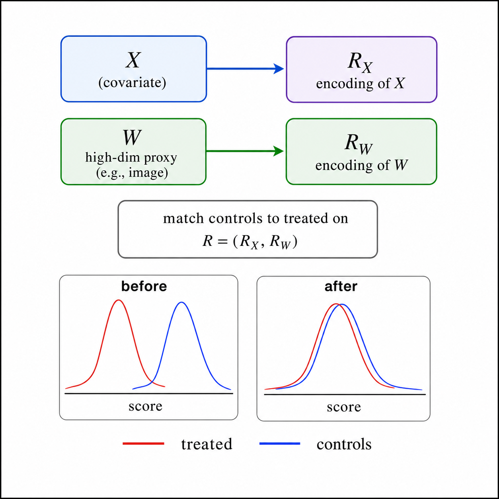
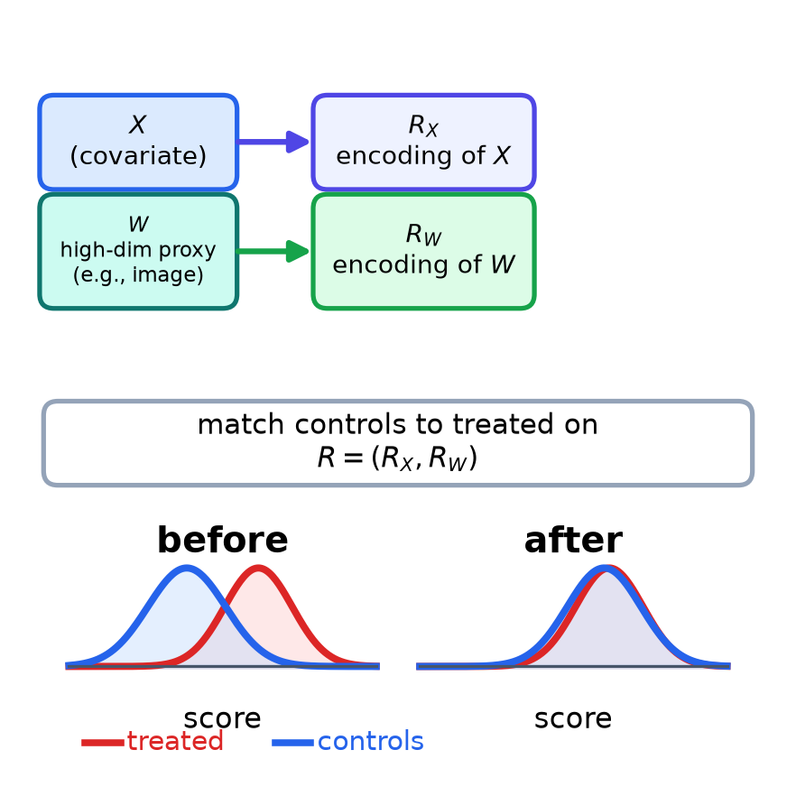

# NSF CAREER A.2 Context

Created: 2026-07-06

This note records the CAREER-facing use of the Single Proxy Balancing idea.

## Current Framing

Aim A.2 asks whether a single pre-treatment proxy $W$ can make hidden severity imbalance visible enough to balance. In the hepatology example, $W$ can be a baseline platelet count, spleen size, or a pre-treatment abdominal scan. The treatment $A$ must not cause $W$.

The proposal-facing representation figure uses:

- $X$: covariates.
- $W$: high-dimensional proxy, for example an image.
- $R_X$: encoding of $X$.
- $R_W$: encoding of $W$.
- $R=(R_X,R_W)$: representation used to match controls to treated units.

## Current Wrapfigure

Preferred imagegen version:

Deterministic Matplotlib version:

## Caption Seed

Single Proxy Balancing encodes measured covariates $X$ and a high-dimensional pre-treatment proxy $W$ into $R=(R_X,R_W)$, then weights controls to match treated units on $R$. If the proxy representation captures the part of $W$ driven by hidden severity, balancing on $R$ reduces hidden-confounding bias without observing $U$.

## Warning

The figure should not say `keeps severity signal in W` inside the graphic. That phrase is the explanation, not the visual label. The figure should keep labels short and let the caption carry the assumption.

