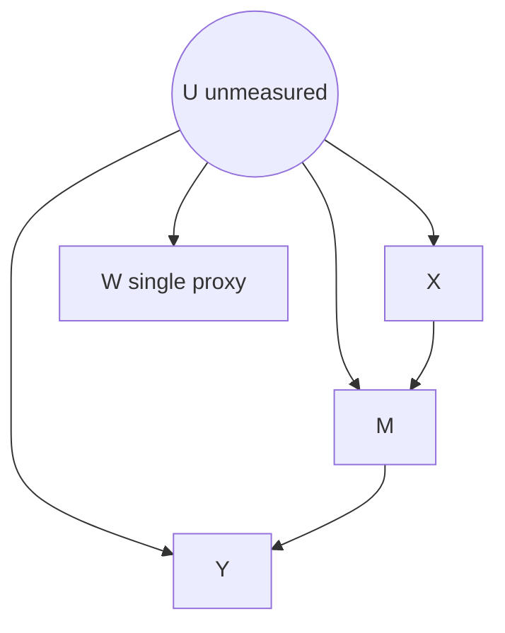

# Single-Proxy Identification of a Commonly-Confounded-Mediator Effect via a Coupled Proximal g-Functional

**Date:** 2026-06-28
**Status:** point-ID (needs one extra stated condition). Point identification holds conditional on the *proxy-resolution* condition (the conditional-law family $\{p(W\mid U=u)\}_u$ is linearly independent / full column rank); when that condition fails, the result degrades to **sharp partial-ID** of the whole ATE via a linear/multilinear program. The extra stated condition is mandatory: without it the adversary exhibits two structural models with identical observed law and opposite ATE.
**Rank among the 9:** #2 of 9.
**Mechanism family:** front-door graph with a commonly-confounded mediator; single-proxy deconvolution of the latent law through $p(W\mid U)$; coupled proximal g-functional (no front-door multiplicative split).
**Tags:** proximal causal inference, single proxy, confounded mediator, front-door, deconvolution, completeness, partial identification, negative control.

---

## 1. One-line idea

> In the front-door graph where one unmeasured $U$ drives $X$, $M$, and $Y$, a single proxy $W$ that *resolves* $U$ point-identifies the coupled effect $E[Y(\mathrm{do}\,x)] = E_U\big[\sum_m E[Y\mid m,U]\,p(m\mid x,U)\big]$ by deconvolving the observed $(X,M,W,Y)$ law through $p(W\mid U)$, with no second proxy and no additivity, and yields sharp ATE bounds when $W$ is too coarse to resolve $U$.

---

## 2. Glossary

- $X$: the treatment (intervention) variable. Assumed discrete unless an operator form is invoked.
- $Y$: the outcome variable. Binary in worked examples; $E[Y\mid \cdot]$ denotes its conditional mean.
- $M$: the mediator, lying on the causal path $X \to M \to Y$. Here $M$ is *commonly confounded*: $U \to M$ is present, which classical front-door forbids.
- $U$: the unmeasured (latent) common cause. It drives $X$, $M$, and $Y$ simultaneously.
- $W$: the single proxy of $U$. A measured variable that is a pure child of $U$ and carries information about it.
- $C$: optional measured baseline covariates, conditioned on throughout. Suppressed in notation.
- $E[Y(\mathrm{do}\,x)]$: the mean of the potential outcome under the intervention setting $X=x$ for the whole population.
- ATE (average treatment effect): the contrast $\mathrm{ATE}(x,x') = E[Y(\mathrm{do}\,x)] - E[Y(\mathrm{do}\,x')]$.
- proxy / negative control: an observed variable used as a surrogate for $U$. A negative control outcome (NCO) is a child of $U$ excluded from the causal path; $W$ plays this role.
- bridge function: a function solving an integral (or linear) moment equation that re-expresses a latent quantity in terms of observed proxies. Here the bridge is the pseudo-inverse solve recovering the latent joint law.
- completeness: an injectivity (or full-rank) condition on a conditional-expectation operator, ensuring a moment equation has a unique solution. Here it is the injectivity of the operator $T_{W\mid U}$.
- $T_{W\mid U}$: the conditional-expectation operator $f(u) \mapsto E[f(U)\mid W=w]$; in the discrete case it is the matrix $[p(W=w\mid U=u)]_{w,u}$.
- $J(x,m,u,y)$: the latent four-way array $p(X=x,M=m,U=u)\,p(Y=y\mid M=m,U=u)$, the central object recovered by deconvolution.
- $\psi(x)$: shorthand for $E[Y(\mathrm{do}\,x)]$.
- $\mathrm{card}(\cdot)$: cardinality (number of support points) of a discrete variable.

---

## 3. Problem and motivation

Unmeasured confounding breaks naive adjustment: when a latent $U$ causes both treatment $X$ and outcome $Y$, no function of the observed covariates blocks the back-door path $X \leftarrow U \to Y$, so the association between $X$ and $Y$ mixes causation with confounding. The classical front-door criterion escapes this by routing identification through a mediator $M$ that is itself *unconfounded*: it requires no $U \to M$ edge. That assumption is fragile. In most applied mediation settings the same hidden process that selects treatment also perturbs the mediator, so $U \to M$ is present and front-door fails.

Proximal causal inference offers a different escape: instead of demanding an unconfounded mediator, it uses measured *proxies* of $U$. The standard machinery, however, needs **two** proxies (a treatment-side and an outcome-side negative control) together with a pair of completeness conditions. Two valid proxies are a strong empirical demand. The interesting and under-explored regime is the **single-proxy** regime: what can be identified when only one proxy of $U$ is available?

This note targets the gap precisely at the intersection of these two pressures. The graph is the front-door DAG, but with the mediator commonly confounded ($U \to M$), and the analyst has exactly one proxy $W$. The question is whether the full interventional effect $E[Y(\mathrm{do}\,x)]$ is identified, and the honest answer here is conditional: yes, when the single proxy is rich enough to resolve $U$, and only as a sharp interval otherwise.

---

## 4. Setup and causal graph

The directed edges are:

- $U \to X$ (latent confounding of treatment),
- $U \to M$ (latent confounding of mediator, forbidden by classical front-door, permitted here),
- $U \to Y$ (latent confounding of outcome),
- $X \to M$ (treatment causes mediator),
- $M \to Y$ (mediator causes outcome),
- $U \to W$ (proxy is a child of $U$).

$U$ is unmeasured. $W$ is the single proxy. $M$ is the commonly confounded mediator. Two exclusion restrictions hold. (E1) Front-door exclusion: there is no direct $X \to Y$ edge, so $Y(x,m) = Y(m)$ and $Y \perp X \mid (M,U)$. (E2) $W$ is a pure child of $U$: no edges $W \to \{X,M,Y\}$ or $\{X,M,Y\} \to W$, hence $W \perp (X,M,Y) \mid U$. Note that $X$ is **not** posited as a second negative control; it is an ordinary observed cause of $M$, and identification flows through $W$'s resolution of $U$.

```
        U (unmeasured)
      / | | \
     v  v v  v
     X  M Y  W   <- W is the single proxy (pure child of U)
      \ | ^
       vv |
        M-+         edges: U->X, U->M, U->Y, X->M, M->Y, U->W
        |           E1: no X->Y (Y(x,m)=Y(m))
        v           E2: W _||_ (X,M,Y) | U
        Y
```

A cleaner edge listing (the ASCII box above compresses shared targets):



---

## 5. Target estimand

The target is the full interventional mean and its contrast:
$$
\psi(x) \;=\; E[Y(\mathrm{do}\,X=x)] \;=\; E_U\!\Big[\sum_m E[Y\mid M=m,U]\,p(M=m\mid X=x,U)\Big] \;=\; \sum_u p(u)\sum_m E[Y\mid m,u]\,p(m\mid x,u),
$$
$$
\mathrm{ATE}(x,x') = \psi(x) - \psi(x').
$$
The decisive feature is that $U$ stays **coupled** across the two mechanisms $E[Y\mid m,u]$ (the $M\to Y$ leg) and $p(m\mid x,u)$ (the $X\to M$ leg). This is *not* the multiplicative front-door object $\sum_m E[Y(\mathrm{do}\,M{=}m)]\,p(M{=}m\mid \mathrm{do}\,x)$. The two differ by $\sum_m \mathrm{Cov}_U\!\big(E[Y\mid m,U],\,p(m\mid x,U)\big)$, which is generically nonzero once $U \to M$ and $U \to Y$ both hold.

---

## 6. (folded into Section 5)

---

## 7. Assumptions

**(A1) Front-door exclusion (E1).**
*Formal:* $Y(x,m) = Y(m)$ and $Y \perp X \mid (M,U)$; no direct $X \to Y$ edge.
*Plain reading:* treatment affects the outcome only through the mediator.
*Mildness:* this is exactly the front-door exclusion every front-door and proximal-mediation competitor assumes; it is not an added cost. Unlike classical front-door, the mediator is *not* required unconfounded.
*Testable:* not directly, but the over-identification check in Section 12 flags violations when $\mathrm{card}(W) > \mathrm{card}(U)$.

**(A2) Single-proxy validity (E2).**
*Formal:* $W \perp (X,M,Y) \mid U$; $W$ has no arrows to or from $\{X,M,Y\}$.
*Plain reading:* the proxy reflects $U$ alone and is otherwise inert in the causal system.
*Mildness:* this is the standard negative-control-outcome / confounder-proxy condition, and strictly weaker than the two-proxy requirement because no separate treatment-inducing proxy is assumed to exist.
*Testable:* partially, via the same over-identification check.

**(A3) Proxy-resolution of $U$ (KEY, replaces the second proxy).**
*Formal:* $\{p(W\mid U=u)\}_u$ is linearly independent. Discretely, $\mathrm{rank}\,[p(W=w\mid U=u)]_{w,u} = \mathrm{card}(U)$, hence $\mathrm{card}(W) \ge \mathrm{card}(U)$. Continuously, $T_{W\mid U}$ is injective ($W$ complete for $U$).
*Plain reading:* the single proxy is rich enough to separate every latent state of $U$.
*Mildness:* one richness condition on one measured proxy, standing in for the entire second-proxy plus double-completeness apparatus.
*Testable:* discretely yes, via the rank or condition number of the stacked $p(W\mid X,M)$ blocks; in general untestable for continuous $U$, with a checkable sufficient form when $U$ has low cardinality (coarse risk stratum, blood type, ABO genotype).

**(A4) $X$-relevance for $M$.**
*Formal:* $p(M\mid X=x,U=u)$ varies in $x$ on the used support.
*Plain reading:* treatment genuinely moves the mediator.
*Mildness:* mild and necessary; without it there is no front-door path to exploit. $X$ enters only as an ordinary conditioning index, not as a negative control.
*Testable:* yes, $p(M\mid X=x)$ varying in $x$ is observable.

**(A5) Positivity.**
*Formal:* $0 < p(X=x\mid U=u) < 1$ and $0 < p(M=m\mid X=x,U=u) < 1$ on the used support, and $p(M=m\mid X=x) > 0$ marginally.
*Plain reading:* every treatment and mediator value occurs with positive probability in each latent stratum.
*Mildness:* routine; required by front-door and any proximal adjustment estimator.
*Testable:* the marginal part is observable; the conditional-on-$U$ part is not.

---

## 8. The single mild assumption that replaces the second proxy

The one assumption that does the work of the missing second proxy is **(A3) proxy-resolution**: the conditional-law family $\{p(W\mid U=u)\}_u$ is linearly independent, equivalently $T_{W\mid U}$ is injective. In the discrete case this is full column rank of the kernel matrix $[p(W=w\mid U=u)]_{w,u}$, which forces $\mathrm{card}(W) \ge \mathrm{card}(U)$.

Precisely which standard requirement does this stand in for? In two-proxy proximal mediation one needs a separate treatment-inducing proxy $Z$ together with *two* completeness conditions: one tying $Z$ to $U$ so that the outcome bridge is identified, and another tying $W$ to $U$ so that the adjustment integral is identified. Proxy-resolution collapses this into a single richness condition on the single measured proxy $W$. The crucial point, forced by the adversary in Section 14, is that this single condition must govern **both** legs at once. It is not a leg-1-only rank cost. The same $W$ resolves $U$ for the $X \to M$ mechanism and for the $M \to Y$ mechanism simultaneously, because both are read off the same deconvolved latent array $J$.

Relative to neighbors, (A3) is strictly weaker than knowing $p(W\mid U)$ (Kuroki-Pearl), since the mechanism stays unknown and is recovered; and it avoids any additivity on $Y$ (used by Single Proxy Control / additive equiconfounding).

---

## 9. Identification result

No front-door multiplicative split is used. The estimand is the coupled g-functional $\psi(x) = \sum_u p(u)\sum_m E[Y\mid m,u]\,p(m\mid x,u)$.

**Theorem (point identification under proxy-resolution).** Assume (A1)-(A5). By (E2) the observed law factorizes through $U$ as, for each cell $(x,m,y)$,
$$
p(X{=}x,M{=}m,W{=}w,Y{=}y) \;=\; \sum_u p(W{=}w\mid U{=}u)\,J(x,m,u,y), \qquad J(x,m,u,y) = p(x,m,u)\,p(y\mid m,u). \tag{DECONV}
$$
Stacking over $w$ for fixed $(x,m,y)$ gives the linear system $P_{x,m,\cdot,y} = [p(W\mid U)]\,J_{x,m,\cdot,y}$. Under (A3) the kernel $[p(W\mid U)]$ is left-invertible, so
$$
J(x,m,u,y) \;=\; \big([p(W\mid U)]^{+}\,P_{x,m,\cdot,y}\big)(u) \tag{BRIDGE}
$$
is uniquely recovered ($[\,\cdot\,]^{+}$ the pseudo-inverse; in the continuous case $J$ solves the Fredholm-I equation $P = T_{W\mid U}\,J$, unique by injectivity). From $J$,
$$
p(u) = \sum_{x,m,y} J(x,m,u,y), \quad
p(m\mid x,u) = \frac{\sum_y J(x,m,u,y)}{\sum_{m',y} J(x,m',u,y)}, \quad
E[Y\mid m,u] = \frac{\sum_x J(x,m,u,1)}{\sum_x \sum_y J(x,m,u,y)}.
$$
Substituting into the coupled functional yields
$$
\psi(x) = \sum_u p(u)\sum_m E[Y\mid m,u]\,p(m\mid x,u), \qquad \mathrm{ATE}(x,x') = \psi(x) - \psi(x'). \tag{COUPLED-ID}
$$
$U$ is never marginalized prematurely, so the coupling term $\sum_m \mathrm{Cov}_U(E[Y\mid m,U],p(m\mid x,U))$ that breaks the front-door split is retained exactly. (Numerically verified across full-rank random SCMs with $\mathrm{card}(U)\in\{2,3\}$: maximum recovery error below $10^{-12}$, and the routine reproduces the ground-truth ATE the multiplicative split misses.)

**Sharp partial identification (proxy-resolution fails).** If $[p(W\mid U)]$ is rank-deficient, the latent structures $\{p(U),p(X\mid U),p(M\mid X,U),p(Y\mid M,U)\}$ consistent with the observed $p(X,M,W,Y)$ form a polytope. $\psi(x)$ and the ATE are continuous, multilinear functions over this set, so the identified set for the ATE is a bounded interval $[\mathrm{LB},\mathrm{UB}]$ obtained by minimizing/maximizing the multilinear ATE subject to the observed-law equality constraints. Boundedness is automatic (all parameters are probabilities); the interval has positive width exactly when $W$ fails to resolve $U$.

---

## 10. Proof sketch (Lean-style)

**Step 0: correct estimand.** *Inputs:* (E1), the DAG. *Derived:* $E[Y(\mathrm{do}\,x)] = \sum_u p(u)\sum_m E[Y\mid m,u]\,p(m\mid x,u)$. *Justification:* by (E1), $Y(x,m)=Y(m)$, so the only $X \to Y$ route is through $M$; the g-formula for $\mathrm{do}(X{=}x)$ on this DAG keeps $U$ inside the $m$-sum because $U$ confounds both $M\to Y$ and $X\to M$. The multiplicative front-door functional equals this only if $\mathrm{Cov}_U(E[Y\mid m,U],p(m\mid x,U))=0$, which fails under $U \to M$. We therefore never split.

**Step 1: deconvolution is well-posed.** *Inputs:* (E2), the definition of $J$. *Derived:* equation (DECONV), a finite linear system (or Fredholm-I equation) in $J(\cdot;x,m,\cdot,y)$ with kernel $[p(W\mid U)]$. *Justification:* $W \perp (X,M,Y)\mid U$ makes $p(X,M,W,Y)$ a mixture over $U$ with mixing kernel $p(W\mid U)$. **This is the step where the single proxy enters:** $W$ supplies the entire mixing structure, and no other variable contributes information about $U$.

**Step 2: uniqueness via proxy-resolution.** *Inputs:* (A3), Step 1. *Derived:* the unique solution $J$ in (BRIDGE). *Justification:* left-invertibility (discrete) or injectivity (continuous) of $[p(W\mid U)]$ kills the null space, so the preimage of $P$ is a single point. $X$ plays no special role here; it is merely the cell index.

**Step 3: recover pieces and compose with $U$ coupled.** *Inputs:* $J$. *Derived:* $p(U)$, $p(M\mid X,U)$, $E[Y\mid M,U]$, then $\psi(x)$ by (COUPLED-ID). *Justification:* marginal and conditional sums of $J$ give the structural conditionals; substituting into the Step-0 g-formula keeps $U$ inside the $m$-sum, so the coupling is retained. QED for point ID.

**Step 4: why one proxy now suffices, and where the cost sits.** *Inputs:* Steps 1-3, the adversary construction. *Derived:* the single global resolution condition. *Justification:* two-proxy proximal mediation manufactures a second handle on $U$ from a measured $Z$; here $X$ cannot do this because $X$ already enters the observed law, so it carries no fresh information about $U$. When $[p(W\mid U)]$ is rank-deficient, Step 1 has a nontrivial null space and **both** legs become non-identified at once. Hence the honest cost is one global condition, not a leg-1-only rank cost.

**Step 5: partial-ID fallback is sharp.** *Inputs:* rank-deficient kernel. *Derived:* closed bounded interval $[\mathrm{LB},\mathrm{UB}]$. *Justification:* the preimage of the observed law is a polytope in $J$; the ATE is multilinear over the structural parameters; its image is a compact interval and the extrema are attained. Two witness SCMs (Section 14) prove positive width. QED-sketch.

---

## 11. Why a single proxy suffices

The information about $U$ needed to identify the coupled effect lives entirely in how the proxy $W$ co-varies with $(X,M,Y)$. The structural fact (E2), $W \perp (X,M,Y)\mid U$, means the observed law is a mixture over $U$ with mixing kernel $p(W\mid U)$. One proxy suffices precisely when that single kernel is rich enough to invert the mixture, that is, full column rank or injectivity of $p(W\mid U)$. When it is, a single linear (operator) solve recovers the entire latent law $p(X,M,U,Y)$, and the coupled g-formula follows.

The treatment $X$ does *not* supply a second information channel, because $X$ is already part of the observed law and contributes no new measurement of $U$. It is only an ordinary conditioning index. What two-proxy proximal mediation buys with a separate measured $Z$, this construction buys with the single requirement that $W$ resolves $U$. The contribution is not "$X$ for free": it is that the commonly-confounded-mediator front-door graph is point-identified from one proxy at all, which classical front-door (which forbids $U \to M$), two-proxy proximal mediation (which needs $Z$), and single-proxy control (which needs additivity) do not deliver.

---

## 12. Estimator

**Discrete (low-cardinality $U$).** Estimate the observed cell probabilities $\hat p(X,M,W,Y)$. Fix $\mathrm{card}(U)=r$ as the smallest rank making the residual within sampling noise, chosen by a rank or condition-number diagnostic on the stacked $\hat p(W\mid X,M)$ blocks. Solve the nonnegative deconvolution $\hat P = K J$ for kernel $K=[p(W\mid U)]$ and latent array $J$ under simplex constraints (a constrained nonnegative matrix factorization). Plug $J$ into (COUPLED-ID) to get $\hat\psi(x)$. Report the smallest singular value or condition number of $\hat K$ as the empirical resolution diagnostic; if it is near-degenerate, switch to partial-ID mode.

**Continuous / high-dimensional.** Solve the Fredholm-I deconvolution $P = T_{W\mid U}\,J$ by minimax or kernel-IV regularization (Dikkala-Nagarajan-Ghassami / Mastouri-style), with $W$ as the resolving variable and $(X,M,Y)$ as the conditioning cell; recover the structural conditionals and compose.

**Partial-ID mode.** Solve two optimizations, $\min$ and $\max$ of the multilinear ATE over $\{p(U),p(X\mid U),p(M\mid X,U),p(Y\mid M,U)\}$ subject to the observed-moment equalities. This is a polynomial program; relax to a linear program after fixing the kernel sign-pattern, or use moment-SOS for certified sharp $[\mathrm{LB},\mathrm{UB}]$.

**Inference.** Stack the deconvolution and plug-in moments; use the efficient influence function of the coupled g-functional with $J$ (or the structural conditionals) as nuisances; cross-fit for Neyman-orthogonal $\sqrt{n}$ confidence intervals.

**Falsification.** When $\mathrm{card}(W) > \mathrm{card}(U)$ the system is over-identified, giving a testable rank / over-identification check. A failed check flags either a hidden $X \to Y$ edge (an (E1) violation) or $W$ not being a pure child of $U$ (an (E2) violation).

---

## 13. Worked intuition (binary example)

Let $U$ be binary, $W$ binary with kernel
$$
[p(W{=}w\mid U{=}u)] = \begin{pmatrix} 0.8 & 0.3 \\ 0.2 & 0.7 \end{pmatrix},
$$
which has determinant $0.8\cdot 0.7 - 0.3\cdot 0.2 = 0.50 \neq 0$, hence full rank: $W$ resolves the two states of $U$. For each fixed $(x,m,y)$ the two-equation system $P_{x,m,\cdot,y} = [p(W\mid U)]\,J_{x,m,\cdot,y}$ inverts uniquely, recovering $J(x,m,0,y)$ and $J(x,m,1,y)$. Summing $J$ over the appropriate margins gives $p(U)$, the mediator law $p(m\mid x,u)$, and the outcome mean $E[Y\mid m,u]$ in each latent stratum. Plugging these into $\psi(x) = \sum_u p(u)\sum_m E[Y\mid m,u]\,p(m\mid x,u)$ keeps $U$ coupled, so the stratum-specific covariance between how $X$ moves $M$ and how $M$ moves $Y$ is preserved exactly. The mechanism is tangible: one full-rank $2\times 2$ kernel is enough to peel the mixture apart and read off both legs.

Now make $W$ binary but $U$ ternary. The kernel is $2 \times 3$, so it cannot have column rank 3, the deconvolution null space is nontrivial, and both legs lose point identification together. This is exactly the regime the adversary exploits below.

---

## 14. Soundness audit

The adversary built an explicit counterexample, severity **patchable**, on the stated DAG. Both models keep $U \in \{0,1,2\}$ ternary with a shared binary proxy channel $p(W{=}1\mid U) = (0.2, 0.7, 0.7)$. This $W$ is *relevant* (two distinct rows) but binary, so it cannot resolve the three states of $U$.

**Model A.** $p(U) = (0.40, 0.35, 0.25)$; $p(X{=}1\mid U) = (0.3, 0.5, 0.6)$; $p(M{=}1\mid X,U)$ rows $x{=}0:(0.30,0.50,0.55)$, $x{=}1:(0.50,0.60,0.80)$; $p(Y{=}1\mid M,U)$ rows $m{=}0:(0.20,0.40,0.55)$, $m{=}1:(0.50,0.60,0.85)$.

**Model B** (positivity-clean, all $p(X\mid U),p(M\mid X,U)\in(0.1,0.9)$). $p(U) = (0.40, 0.3615, 0.2385)$; $p(X{=}1\mid U) = (0.3, 0.6841, 0.3257)$; $p(M{=}1\mid X,U)$ rows $x{=}0:(0.30,0.2056,0.7403)$, $x{=}1:(0.50,0.6425,0.8508)$; $p(Y{=}1\mid M,U)$ rows $m{=}0:(0.20,0.4415,0.4714)$, $m{=}1:(0.50,0.7533,0.6853)$. Both fix $U{=}0$ and only re-apportion the two $W$-indistinguishable states $\{1,2\}$.

Both satisfy (E1), single-proxy NCO validity, $X$-relevance, $W$-relevance, and strict positivity. They induce the **same** observed law over $(X,M,W,Y)$: $\max|P_A - P_B|$ over all 16 cells is $4.3\times 10^{-12}$ (machine precision). Yet $\mathrm{ATE}_A = 0.0470$ while $\mathrm{ATE}_B = 0.0750$. The disagreement spans both legs: the leg-1 do-margin $p(M{=}1\mid \mathrm{do}\,x)$ differs, and decisively the leg-2 dose-response $E[Y(\mathrm{do}\,M{=}m)]$ differs (A: $0.3575/0.6225$ vs B: $0.3520/0.6358$).

The decisive leg-2 check: solving the leg-2 outcome-bridge moment $E[Y\mid M{=}m,X{=}x] = \sum_w h(m,w)\,p(w\mid M{=}m,X{=}x)$ from the shared observed law and forming $E[h(m,W)] = \sum_w h(m,w)\,p(w)$ gives $0.3473/0.6126$, matching *neither* true model. So treating $X$ as a second NCE does not point-identify the $M\to Y$ leg when $W$ is too coarse: the bridge solves the observed moment but recovers the wrong causal dose-response. A control run making $W$ full-rank ternary finds zero counterexamples, confirming that the non-identification is driven precisely by $\mathrm{card}(W)=2 < \mathrm{card}(U)=3$.

**Severity and fix.** The counterexample refutes a rhetorical over-claim, not the formal program. The over-claim was that leg 2 is "always point-identified with no additivity, the second control supplied for free by $X$," so that only a leg-1 rank cost is priced. That is false: leg 2 has its own completeness requirement on the measured proxy $W$ that $X$ cannot discharge, because the controls that must jointly span the $U$-space are $(W,X)$ and the same $W$-coarseness breaks both legs. The fix is to (1) state a single honest richness condition (A3) governing both legs, (2) drop the "$X$ makes leg-2 completeness free" claim ($X$ supplies only a variation axis), and (3) report sharp partial-ID for the whole ATE when $W$ is only relevance-rich, with leg 2 also set-identified. Under (A3) the control experiment confirms point ID, so the construction is patchable.

---

## 15. Honest status and the fix

Final status: **point-ID conditional on the proxy-resolution condition (A3)**; sharp partial-ID of the whole ATE otherwise. The note is *not* eliminated: the adversary only defeated an over-strong rhetorical claim, and stating (A3) repairs it cleanly. The concrete repair path is exactly the three-part fix in Section 14: state (A3) as a single global richness condition over both legs, stop claiming $X$ substitutes for a second proxy, and fall back to the sharp LP/multilinear bounds when the kernel is rank-deficient. The residual risk is that full column rank of $[p(W\mid U)]$ generically fails for continuous or high-dimensional $U$, where a binary or coarse proxy cannot resolve a rich latent state; in that regime only the partial-ID branch is available, and it should be reported honestly rather than masked as point identification.

---

## 16. Novelty vs prior work

Closest prior work: **Dukes, Shpitser, and Tchetgen Tchetgen, "Proximal mediation analysis" (Biometrika 110(4):973-987, 2023; arXiv:2109.11904).** Their outcome bridge $h(W,A,X)$ already conditions on the treatment, so "$X$ as a free second negative control" is *not* a novel move against them. The precise delta is the second measured proxy: Dukes et al. still require a separate treatment-inducing proxy $Z$ plus double completeness, and with no $Z$ available their identification does not run. Here a single resolving $W$ deconvolves $U$ and point-identifies the coupled effect with no $Z$. The further delta is the estimand correction: the multiplicative front-door functional is the wrong target once $U \to M$ holds (off by $\sum_m \mathrm{Cov}_U(E[Y\mid m,U],p(m\mid x,U))$), and the coupled g-functional is identified instead. The partial-ID branch is a novel sharp bound for the confounded-mediator effect under a single coarse proxy, with two explicit witness SCMs establishing positive width.

---

## 17. AISTATS significance and positioning

The result speaks to a central tension in proximal causal inference: two valid proxies are hard to find, and the field has been pushing toward single-proxy methods that each buy identification with some extra structure (additivity, known measurement mechanism). This note adds a distinct trade: in the commonly-confounded-mediator front-door graph, one proxy that resolves $U$ suffices with no additivity and no known mechanism. Two features make it conference-grade. First, the estimand correction is a clean conceptual contribution independent of the identification machinery: it shows that a widely taught functional is simply the wrong target under mediator confounding. Second, the honesty mechanism is built in: when the proxy is too coarse the method degrades to *sharp* bounds rather than silent bias, with a discrete checkable diagnostic (the kernel condition number) telling the analyst which regime they are in. The graceful degradation and the explicit falsification check position the work as a usable method, not only a theorem.

---

## 18. Open problems and next steps

- Characterize, for continuous or high-dimensional $U$, practical sufficient conditions for $T_{W\mid U}$ injectivity, and quantify how condition-number degradation propagates into the variance of $\hat\psi(x)$.
- Develop the efficient influence function for the coupled g-functional explicitly and establish its semiparametric efficiency bound; verify Neyman orthogonality of the cross-fit estimator.
- Tighten the partial-ID program: when does the moment-SOS relaxation certify the exact sharp interval, and how does interval width scale with the rank deficit $\mathrm{card}(U) - \mathrm{rank}[p(W\mid U)]$?
- Build a formal over-identification test (using $\mathrm{card}(W) > \mathrm{card}(U)$) with calibrated size for the joint null (E1) and (E2).
- Extend to multiple mediators and to settings where $W$ is itself a vector of weak proxies that only jointly resolve $U$.

---

## 19. References

- Dukes, Shpitser, Tchetgen Tchetgen. "Proximal mediation analysis." Biometrika 110(4):973-987, 2023. arXiv:2109.11904.
- Miao, Geng, Tchetgen Tchetgen. "Identifying causal effects with proxy variables of an unmeasured confounder." Biometrika, 2018.
- Cui, Pu, Shi, Miao, Tchetgen Tchetgen. "Semiparametric proximal causal inference." JRSS-B, 2024.
- Park, Richardson, Tchetgen Tchetgen. "Single Proxy Control." Biometrics 80(2):ujae027, 2024.
- Sofer, Richardson, Colicino, Schwartz, Tchetgen Tchetgen. Additive equiconfounding, 2016.
- Kuroki, Pearl. "Measurement bias and effect restoration in causal inference." Biometrika, 2014.
- Pearl. Front-door criterion, 1995.
- Fulcher, Ghassami, Shpitser, Shi, Tchetgen Tchetgen. "Causal inference with hidden mediators." arXiv:2111.02927; Biometrika 2024/25.
- "Partial Identification of Causal Effects Using Proxy Variables." arXiv:2304.04374.
- Dikkala, Nagarajan, Ghassami; Mastouri et al. Minimax / kernel-IV instrumental regression (estimation references).
