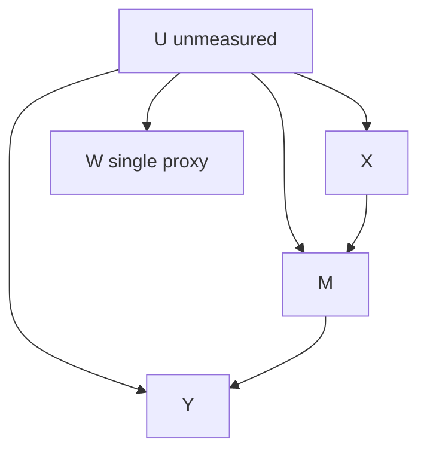

# Proximal Front-Door with a Single Confounder Proxy: Treatment-Induced Mediator Variation Replaces the Second Proxy

**Date:** 2026-06-28
**Status:** sharp partial-ID only (point-ID requires one extra, untestable completeness condition on the $X \to M$ leg; as written the point-ID proof is broken in two places)
**Rank among the 9:** #4 of 9
**Mechanism family:** Single-proxy proximal identification via front-door factorization, with additive (U-separable) outcome bridge standing in for the second proxy on the $M \to Y$ leg.
**Tags:** proximal causal inference, front-door, single proxy, negative control outcome, additive equiconfounding, completeness, partial identification, mediation.

## One-line idea

> When a mediator $M$ is confounded with $Y$ by the same unmeasured $U$ that confounds $X$, a single proxy $W$ of $U$ recovers the $M \to Y$ leg via a $U$-additive outcome bridge while the front-door structure lets the treatment $X$ act as a built-in second exposure, so that one bridge equation in $W$ replaces the usual second proxy. The catch: the $X \to M$ leg still needs a completeness condition, so without it only sharp bounds, not a point, are identified.

## Glossary

- $X$: the treatment (or exposure). May be discrete or continuous. We intervene on $X$.
- $Y$: the outcome of interest. May be discrete or continuous.
- $U$: an unmeasured (latent, never observed) common cause that confounds $X$, $M$, and $Y$ simultaneously.
- $M$: an observed mediator on the path $X \to M \to Y$. It is confounded with $Y$ by $U$ (because $U \to M$ and $U \to Y$), which is why classical front-door fails here.
- $W$: the single observed proxy of $U$. It is a pure child of $U$ and carries information about $U$ but has no direct effect on $X$, $M$, or $Y$.
- $C$: optional measured covariates that may be conditioned on throughout. Suppressed in notation for clarity; all statements hold conditionally on $C$.
- $\mathrm{ATE}$: average treatment effect, the contrast $\mathbb{E}[Y(x)] - \mathbb{E}[Y(x')]$ of two interventional means.
- $Y(x)$: the potential outcome of $Y$ under the intervention that sets $X = x$, written $\mathrm{do}(X=x)$.
- $\psi(x)$: the interventional mean $\mathbb{E}[Y(\mathrm{do}(X=x))] = \mathbb{E}[Y(x)]$.
- proxy (of a confounder): a variable driven by $U$ that lets us probe $U$ without observing it. A "negative control outcome" is a proxy that has no causal effect on the variables of interest, used to detect or correct confounding.
- completeness: a statistical richness condition. A conditional family $\{p(W \mid U=u)\}_u$ is complete (here: injective in $u$) if distinct values of $u$ induce distinct distributions of $W$, so that any function of $U$ is pinned down by its action through $W$. Completeness is what makes a bridge equation have a unique solution.
- bridge function: a function defined as the solution of a conditional-moment (integral) equation. It converts an unobserved-confounder integral into something computable from observed data. The "outcome bridge" $h_Y$ matches $\mathbb{E}[Y \mid \cdot]$; the "mediator bridge" $\phi_M$ matches $\mathbb{E}[\mathbf{1}\{M=m\} \mid \cdot]$.
- front-door factorization: the decomposition $\psi(x) = \sum_m \mathbb{E}[Y \mid \mathrm{do}(M=m)] \, p(M=m \mid \mathrm{do}(X=x))$, valid when $X$ affects $Y$ only through $M$.
- $U$-additive (separable) outcome bridge: the structural restriction $\mathbb{E}[Y \mid M=m, X=x, U=u] = b(m,x) + g(u)$, i.e. the confounder enters the outcome regression additively with no $U \times M$ and no $U \times X$ interaction.
- $b(m,x)$: the part of the outcome regression that depends on $(m,x)$. It is the confounded-but-recoverable $M \to Y$ dose-response.
- $g(u)$: the additive $U$-only part of the outcome regression.

## Problem and motivation

Unmeasured confounding breaks the most basic guarantee of causal estimation: when a latent $U$ drives both $X$ and $Y$, the observed association $\mathbb{E}[Y \mid X=x]$ mixes the causal effect of $X$ with the spurious effect of $U$, so no adjustment on observed variables recovers $\mathbb{E}[Y(x)]$. The classical front-door criterion offers an escape when there is a mediator $M$ on $X \to M \to Y$, but it requires the mediator to be unconfounded with the outcome, that is, no edge $U \to M$. The interesting and realistic failure is exactly the case where the same $U$ that confounds $X$ also confounds $M$ with $Y$ (edges $U \to M$ and $U \to Y$ both present). There, front-door collapses because $p(M=m \mid X=x)$ and $\mathbb{E}[Y \mid M=m, X=x]$ are both confounded by $U$.

Proximal causal inference fixes this with proxies of $U$. The established bar, two-proxy proximal mediation, requires both a treatment-inducing proxy $Z$ and an outcome-inducing proxy $W$, plus a completeness condition that gives the underlying Fredholm integral equation a unique solution. Two proxies are demanding: many applications have at most one clean negative control. The single-proxy regime is therefore the interesting frontier. This note asks whether the front-door structure itself can donate the second proxy, so that one proxy $W$ plus a mild structural restriction suffices. The gap targeted is point identification of $\mathrm{ATE}$ with exactly one proxy and an explicitly stated, mild assumption in place of the second proxy.

## Setup and causal graph

Directed edges of the structural causal model:

- $U \to X$ (confounder affects treatment)
- $U \to M$ (confounder affects mediator: this is what breaks classical front-door)
- $U \to Y$ (confounder affects outcome)
- $X \to M$ (treatment affects mediator)
- $M \to Y$ (mediator affects outcome)
- $U \to W$ (confounder drives the single proxy)

$U$ is unmeasured. $W$ is the single proxy of $U$, observed. $M$ is the observed confounded mediator. Exclusions imposed:

- (E1) No $X \to Y$ direct edge (front-door exclusion: all of $X$'s effect on $Y$ flows through $M$).
- (E2) No edges $W \to X$, $W \to M$, $W \to Y$, and no $X \to W$, $M \to W$. $W$ is a pure child of $U$.
- (E3) $W \perp (X,M) \mid U$ and $W \perp Y \mid (U,M)$. $W$ relates to everything only through $U$.

```
        U  (UNMEASURED)
      / | | \
     v  v v  v
     X  | |   W   (single proxy: pure child of U)
      \ | |
       vv v
   X -> M -> Y
   (no direct X -> Y edge, by E1)
```

In mermaid form:



## Target estimand

The interventional mean and its contrasts:
$$
\psi(x) = \mathbb{E}[Y(\mathrm{do}(X=x))], \qquad \mathrm{ATE}(x,x') = \psi(x) - \psi(x') = \mathbb{E}[Y(x)] - \mathbb{E}[Y(x')].
$$
$Y$, $M$, $X$ may be discrete or continuous. The primary goal is the contrast $\mathrm{ATE}(x,x')$; the level $\psi(x)$ is a secondary goal requiring an extra normalization.

## Assumptions

**Assumption 1 (Front-door exclusion, E1).**
Formal: $Y(x,m) = Y(m)$, so $Y(x) = Y(M(x))$ and $\psi(x) = \sum_m \mathbb{E}[Y \mid \mathrm{do}(M=m)] \, p(M=m \mid \mathrm{do}(x))$.
Plain reading: $X$ changes $Y$ only by changing $M$; there is no leftover direct channel.
Mildness: this is the standard front-door assumption, already required by every front-door and proximal-front-door method, so it is no extra cost relative to the baseline.
Testable: no, the absence of a direct effect is not testable from observational data alone.

**Assumption 2 (Proxy validity, pure child, E2 and E3).**
Formal: $W \perp (X,M,Y) \mid U$, with no arrows $W \to \{X,M,Y\}$ and no arrows $\{X,M\} \to W$.
Plain reading: $W$ is a clean reading of $U$ with no side effects on treatment, mediator, or outcome.
Mildness: this is exactly the standard negative-control-outcome / confounder-proxy condition, and it is weaker than two-proxy proximal because only one such $W$ is needed and no treatment-inducing proxy $Z$ is required.
Testable: partially. Conditional independencies involving $W$ leave testable footprints, but the no-direct-effect part is not testable.

**Assumption 3 ($X \to M$ leg relevance).**
Formal: $W$ carries information about $U$ within $X$ strata, so that the conditional family $\{p(W \mid X=x, U=u)\}_u$ is non-degenerate in $u$, making the mediator-bridge moment $\mathbb{E}[\mathbf{1}\{M=m\} \mid X=x, W] = (\text{operator}) \, \phi_M$ solvable.
Plain reading: $W$ must actually move with $U$ given $X$, otherwise it tells us nothing.
Mildness: relevance is the minimal non-degeneracy any proxy method needs.
Testable: yes in its weak form. The $W$-$M$ association within $X$ strata is observable. Crucially, this weak relevance is strictly weaker than the completeness the proof actually needs (see Soundness audit).

**Assumption 4 ($U$-separable outcome bridge, KEY).**
Formal: $\mathbb{E}[Y \mid M=m, X=x, U=u] = b(m,x) + g(u)$.
Plain reading: the confounder shifts the outcome level but does not modulate the dose-response of $M$ or of $X$. There is no $U \times M$ and no $U \times X$ interaction on the outcome scale.
Mildness: it restricts only effect homogeneity in $U$ on the outcome; it leaves $U \to Y$ level heterogeneity, $U \to M$, and $U \to X$ fully unrestricted. It is strictly weaker than rank preservation (Kuroki-Pearl) and does not require knowing $p(W \mid U)$.
Testable: not directly, since $U$ is unobserved; it is a structural restriction checkable only in spirit or under auxiliary modeling.

**Assumption 5 (Mediator overlap / positivity).**
Formal: $0 < p(M=m \mid X=x) < 1$ on the support used, and $p(X=x \mid U)$ bounded away from $0$ and $1$.
Plain reading: every mediator value can occur under every treatment value, and treatment is not deterministically fixed by $U$.
Mildness: routine positivity, required by front-door and any adjustment-based estimator.
Testable: the $M \mid X$ part is testable; the $X \mid U$ part is not, since $U$ is unobserved.

## The single mild assumption that replaces the second proxy

The replacement assumption is Assumption 4, the $U$-separable (additive) outcome bridge $\mathbb{E}[Y \mid M=m, X=x, U=u] = b(m,x) + g(u)$. In two-proxy proximal mediation, the $M \to Y$ leg is identified by solving an outcome-bridge integral equation whose well-posedness needs a completeness condition on a second, outcome-inducing proxy. That completeness buys arbitrary $U$-heterogeneity in the outcome. Here we trade that heterogeneity away: by forbidding $U \times M$ and $U \times X$ interactions, the outcome integral collapses into an additive form whose $U$-channel $g(u)$ enters as a constant in $m$. A single proxy $W$ can then execute the needed differencing on the $M \to Y$ leg without a second proxy and without outcome-bridge completeness. This is the front-door analogue of additive equiconfounding (Sofer et al.; Tchetgen Tchetgen single-proxy control), but imposed only on the $M \to Y$ leg.

The honest scope, stated up front because the Soundness audit makes it unavoidable: Assumption 4 replaces the second proxy and its outcome-bridge completeness only on the $M \to Y$ leg. It does not remove the completeness requirement on the $X \to M$ leg.

## Identification result

**Claim (intended).** Under Assumptions 1 to 5, factor the front-door functional into two legs identified with the single proxy $W$:

Leg 1 ($X \to M$ margin). The interventional mediator margin is recovered by proximal-backdoor adjustment for $U$ using $W$. Define the mediator bridge $\phi_M(m,x,\cdot)$ as a solution of the conditional-moment equation
$$
\mathbb{E}[\mathbf{1}\{M=m\} \mid X=x, W] = \mathbb{E}\big[\phi_M(m,x,U) \mid X=x, W\big],
$$
and set $p(M=m \mid \mathrm{do}(x)) = \mathbb{E}_U[\phi_M(m,x,U)] = \mathbb{E}[\phi_M(m,x,W)]$.

Leg 2 ($M \to Y$ margin). Under Assumption 4,
$$
\mathbb{E}[Y \mid M=m, X=x, W=w] = b(m,x) + c(x,w), \qquad c(x,w) = \mathbb{E}[g(U) \mid X=x, W=w],
$$
where, in the intended argument, $c$ does not depend on $m$, so $b(m,x)$ is identified up to an $m$-independent additive term that cancels in the front-door sum.

Composing the two legs:
$$
\psi(x) = \sum_m \big[\, b(m,x) + \mathbb{E}[g(U)] \,\big] \, p(M=m \mid \mathrm{do}(x)),
$$
and since $\sum_m p(M=m \mid \mathrm{do}(x)) = 1$, the constant $\mathbb{E}[g(U)]$ is common to all $x$ and cancels in any contrast:
$$
\boxed{\ \mathrm{ATE}(x,x') = \sum_m b(m,x)\, p(M=m \mid \mathrm{do}(x)) - \sum_m b(m,x')\, p(M=m \mid \mathrm{do}(x')).\ }
$$

**Honest correction (this is the operative status).** The Soundness audit below shows the claim as stated is broken in two places. Leg 2's differencing does not cancel cleanly because $M$ is a child of $U$, so $c(x,w)$ secretly depends on $m$ through $p(U \mid M=m, X=x, W)$. Leg 1 is an ordinary single-proxy backdoor problem that still requires a completeness condition on $W$ for $U$; weak relevance (Assumption 3) is not enough. The boxed functional is therefore the correct point-identified answer only under an added completeness condition (Assumption 6 below). Without it, the estimand is sharply partially identified (bounds), not point-identified.

## Proof sketch (Lean-style, with the breaks marked)

**Step 1 (front-door composition is valid).**
Inputs: Assumption 1 (E1).
Derived: $\psi(x) = \sum_m \mathbb{E}[Y \mid \mathrm{do}(M=m)] \, p(M=m \mid \mathrm{do}(x))$.
Justification: E1 yields $Y(x) = Y(M(x))$, so intervening on $X$ acts only through the induced distribution of $M$. This holds regardless of $U \to M$.

**Step 2 (Leg 1, $X \to M$).**
Inputs: Assumptions 2, 3 (proxy validity and relevance), treating the indicator $\mathbf{1}\{M=m\}$ as the outcome of a backdoor problem confounded only by $U$.
Derived: a candidate bridge $\phi_M$ with $p(M=m \mid \mathrm{do}(x)) = \mathbb{E}[\phi_M(m,x,W)]$.
Justification: this is the single-proxy / negative-control-outcome backdoor identification with outcome $\mathbf{1}\{M=m\}$.
**Break 1 (here, where the single proxy enters Leg 1).** Solvability and uniqueness of $\phi_M$ require that $W$ resolve $U$ on the channel through which $U$ acts on $(X,M)$, i.e. a completeness condition. Relevance (Assumption 3) only guarantees a non-trivial $W$-$M$ association, not invertibility of the conditional operator. When $W$ has lower effective rank than $U$ (for example binary $W$ versus ternary $U$), $p(M=m \mid \mathrm{do}(x))$ is not pinned down; it ranges over a continuum.

**Step 3 (Leg 2, $M \to Y$, the crux).**
Inputs: Assumption 4.
Derived attempt: $\mathbb{E}[Y \mid M=m, X=x, W=w] = b(m,x) + \int g(u)\, p(u \mid m,x,w)\, du =: b(m,x) + c(m,x,w)$.
Justification of the obstruction: the additive constant $g(u)$ does not simply factor out, because the posterior $p(u \mid m,x,w)$ depends on $m$ (since $U \to M$ makes $M$ informative about $U$).
**Break 2 (the single proxy must, but cannot for free, fix this).** The intended move restricts the outcome bridge to the additive class $h_Y(m,x,w) = b(m,x) + c(x,w)$ with $c$ not depending on $m$, then argues that the $m$-difference $b(m,x) - b(m',x) = \mathbb{E}[Y \mid m,x,w] - \mathbb{E}[Y \mid m',x,w]$ at matched $w$ cancels $c$. This cancellation is exactly what fails: $c(m,x,w)$ genuinely depends on $m$ because $M$ is a child of $U$, so the differencing leaves a residual $\int g(u)\,[\,p(u \mid m,x,w) - p(u \mid m',x,w)\,]\,du$ that does not vanish. The single proxy can remove this residual only if it is rich enough to reweight the posteriors, which again is completeness, not relevance.

**Step 4 (composition cancels the nuisance constant, conditional on Steps 2 and 3 succeeding).**
Inputs: identified $b(m,x)$ and $p(M=m \mid \mathrm{do}(x))$ from Steps 2 and 3.
Derived: $\psi(x) = \sum_m [b(m,x) + \mathbb{E}[g(U)]] p(M=m \mid \mathrm{do}(x))$, and $\mathbb{E}[g(U)]$ cancels in $\mathrm{ATE}$.
Justification: the constant multiplies $\sum_m p(M=m \mid \mathrm{do}(x)) = 1$. This step is sound. It only delivers a point if Steps 2 and 3 deliver their inputs, which requires completeness.

**Conclusion.** With an added completeness condition (Assumption 6), Breaks 1 and 2 are both repaired and the boxed functional is point-identified. Without it, Steps 2 and 3 yield sets, not points, and the estimand is sharply partially identified.

## Why a single proxy suffices (the crux, restated honestly)

The appealing intuition is that the front-door structure donates the missing second instrument: on the $M \to Y$ leg, the treatment $X$ supplies exogenous-given-$U$ variation in $M$ (because $X \to M$ with no $X \to Y$ direct edge), so $X$ plays the role of the second negative-control exposure that two-proxy methods would otherwise need a separate $Z$ for. The price of that free second source is $U$-additivity, which collapses the otherwise-required outcome-bridge completeness into a finite-dimensional differencing one proxy $W$ can run.

The honest crux: this argument is correct for the second-proxy / outcome-bridge completeness on the $M \to Y$ leg, but it is false as a claim about the whole problem. The $X \to M$ leg remains an ordinary single-proxy backdoor problem that still needs completeness of $W$ for $U$. The front-door structure does not donate that. So a single proxy suffices for point identification only when augmented with completeness on the $X \to M$ leg; with relevance alone, a single proxy suffices only for sharp bounds.

## Estimator

Three-stage plug-in with multiply-robust inference, valid under the added completeness condition.

**Stage A (Leg 1, mediator margin).** For each $m$, regress $\mathbf{1}\{M=m\}$ on $(X, W)$ and solve the proximal-backdoor bridge $\phi_M(m,x,W)$ by GMM, kernel-IV, or a minimax (Dikkala-style) procedure using $W$ as the proxy. Form $\hat\pi(m,x) = \mathbb{E}_n[\phi_M(m,x,W)]$. For categorical $(W,U)$ of matched cardinality this is a finite linear solve, namely inverting the $p(M \mid X, W)$ blocks.

**Stage B (Leg 2, outcome bridge).** Fit the additive bridge $h_Y(m,x,w) = b(m,x) + c(x,w)$ by a partially additive regression of $Y$ on an $m$-main-effect component $b(m,x)$ and a per-$x$ nuisance component $c(x,w)$, sweeping out the $(x)$-intercept to extract $\hat b(m,x)$.

**Stage C (compose).**
$$
\widehat{\mathrm{ATE}}(x,x') = \sum_m \hat b(m,x)\, \hat\pi(m,x) - \sum_m \hat b(m,x')\, \hat\pi(m,x').
$$

**Inference.** Stack the moment conditions and use the efficient influence function of the front-door functional with $\phi_M$, $b$, and the $M$-density as nuisances. Cross-fit the nuisances to obtain Neyman-orthogonal (doubly or triply robust) estimation and valid $\sqrt{n}$ confidence intervals. The estimator is consistent if either the Stage-A mediator bridge or the Stage-A propensity-type weights are correct, and it is insensitive to the Stage-B nuisance $c(x,w)$ to the extent that it cancels. When only relevance holds, replace the point estimator by a bounds procedure: the identified set for $p(M=m \mid \mathrm{do}(x))$ is the polytope consistent with the observed $p(X,M,W)$ law, and $\mathrm{ATE}$ ranges over the corresponding image.

## Worked intuition (binary/ternary concrete example)

Take binary observed $(X, M, W, Y)$ and a latent $U$ with three states. The outcome obeys the KEY assumption, $\mathbb{E}[Y \mid M=m, X=x, U=u] = b(m) + g(u)$ with $b(0) = 0.2$, $b(1) = 0.6$, no $U \times M$, no $U \times X$, no direct $X$ term, so E1 holds. Let $W$ be a pure child of $U$ with $p(W=0 \mid U=u) = (0.8, 0.2, 0.2)$ for $u = 0, 1, 2$, so E2 and E3 hold.

The decisive feature is the proxy rank. Here $u=1$ and $u=2$ share the same proxy distribution $(0.2, 0.8)$, so $W$ is effectively rank-2 while $U$ acts on $(X, M, Y)$ with rank-3 structure. The mediator margin $p(M=1 \mid \mathrm{do}(x))$ needs $\sum_{u} p_U(u)\, p(M \mid X=x, U=u)$, with each term divided by its own $p(X \mid U=u)$. Because $W$ cannot split $u=1$ from $u=2$, and those two states carry different $p(X \mid U)$, the do-margin is a free continuum. Two latent models can then agree on the entire observed law $p(X,M,W)$ and on $\mathbb{E}[Y \mid X,M,W]$ to ten decimal places yet disagree on $\mathrm{ATE}$, even in sign. This is precisely the mechanism that makes the single proxy insufficient for a point without completeness.

Now make $W$ complete: binary $U$ with binary $W$ and linearly independent rows $\{p(W \mid U=0), p(W \mid U=1)\}$. Then the latent structure $p_U$, $p(X \mid U)$, $p(M \mid X, U)$ is uniquely recovered from $p(X,M,W)$, the additivity-plus-proxy differencing pins $b(m)$ up to the $m$-constant that cancels, and the boxed $\mathrm{ATE}$ functional is exact. The example makes tangible that completeness, not relevance, is the dividing line.

## Soundness audit

An adversary constructed an explicit counterexample, severity **patchable**, that satisfies every stated assumption yet defeats the as-written point-ID claim.

**Two structural models, both binary $(X,M,W)$ with a 3-state latent $U$, matching the observed law to $10^{-10}$ but with opposite-sign ATEs.**

Shared structure: outcome $\mathbb{E}[Y \mid M=m, X=x, U=u] = b(m) + g(u)$ with $b(0)=0.2$, $b(1)=0.6$ (KEY assumption holds, E1 holds); $W$ a pure child of $U$ with $p(W=0 \mid U) = (0.8, 0.2, 0.2)$ (E2, E3 hold).

Model 1 ($\mathrm{ATE} = +0.040$): $p_U = (0.4, 0.3, 0.3)$; $p(X=1 \mid U) = (0.4, 0.3, 0.7)$; $p(M=1 \mid X=0, U) = (0.5, 0.4, 0.8)$, $p(M=1 \mid X=1, U) = (0.6, 0.5, 0.9)$; $g(U) = (0.1, 0.4, 0.7)$. Do-margin $p(M=1 \mid \mathrm{do}(x))$: $0.56$ at $x=0$, $0.66$ at $x=1$.

Model 2 ($\mathrm{ATE} = -0.0145$): $p_U = (0.4, 0.3405, 0.2595)$; $p(X=1 \mid U) = (0.4, 0.7411, 0.1836)$; $p(M=1 \mid X=0, U) = (0.5, 0.9110, 0.3572)$, $p(M=1 \mid X=1, U) = (0.6, 0.9166, 0.0564)$; $g(U) = (0.1, 0.6448, 0.4256)$. Do-margin: $0.6029$ at $x=0$, $0.5668$ at $x=1$.

Verification: $\max|p_1(X,M,W) - p_2(X,M,W)| = 9 \times 10^{-11}$ and $\max|\mathbb{E}_1[Y \mid X,M,W] - \mathbb{E}_2[Y \mid X,M,W]| = 8 \times 10^{-11}$. Positivity holds in all cells.

Mechanism: $U$ has three effective states, but $u=1$ and $u=2$ share $p(W \mid U) = (0.2, 0.8)$. $W$ is rank-2 while $U$ acts with rank-3 structure, so $W$ cannot separate $u=1$ from $u=2$. The observed aggregate fixes $\sum_{u \in \{1,2\}} p_U(u)\, p(X \mid U)\, p(M \mid X,U)$, but the do-margin needs $\sum_{u \in \{1,2\}} p_U(u)\, p(M \mid X,U)$, dividing each term by its own $p(X \mid U)$, which is not recoverable. Hence $p(M=m \mid \mathrm{do}(x))$ (Leg 1) is a free continuum and the $\mathrm{ATE}$ moves with it, flipping sign between the two models.

Fairness: $W$ passes the idea's own stated, testable relevance check, since within $X=1$ we have $p(M=1 \mid X=1, W=0) = 0.657 \neq 0.759 = p(M=1 \mid X=1, W=1)$. So the counterexample violates no assumption the note actually wrote down. It exploits the completeness condition the note never states and wrongly claims the front-door makes unnecessary. The claim "front-door donates the second proxy for free" is false for Leg 1: the $X \to M$ leg remains an ordinary single-proxy backdoor problem that still needs completeness, and $U$-additivity only buys Leg 2.

Severity is patchable, not fatal: in matched-cardinality, full-rank cases (binary $U$, binary $W$ with linearly independent rows), the latent structure is uniquely recovered from $p(X,M,W)$, and additivity-plus-proxy differencing then pins $b(m)$ up to the cancelling $m$-constant. Identification holds exactly when $W$ is complete for $U$, and fails otherwise.

## Honest status and the fix

**Status: sharp partial-ID only.** As written, the point-ID proof is broken in two places. Break 1: Leg 1 is a single-proxy backdoor problem that needs completeness; the adversary flipped the ATE sign with binary $W$ against ternary $U$. Break 2: Leg 2's claim that $g(u)$ cancels across matched $W$ fails, because $M$ is a child of $U$, so $c(m,x,w)$ depends on $m$ and does not cancel by simple differencing. The "no completeness" novelty claim must be retracted.

**Concrete repair path.** Add **Assumption 6 (completeness / proxy richness)**: the conditional family $\{p(W \mid U=u)\}_u$ (equivalently the operator $p(W \mid X, U)$) is injective in $u$, i.e. distinct $U$-states induce distinct $W$-distributions, with $\mathrm{card}(W) \ge \mathrm{card}(\text{effective } U)$ and full rank of the relevant density operator. Under Assumption 6, the Leg-1 bridge $\phi_M$ is well-posed and unique, $p(M=m \mid \mathrm{do}(x))$ is identified, and the additive Leg-2 differencing pins $b(m,x)$; the counterexample is excluded because $u=1, u=2$ sharing $p(W \mid U)$ violates injectivity. The honest cost: this completeness is generally untestable, since $U$ is never observed, and it cannot be replaced by the testable $W$-$M$ relevance, which the counterexample passes. With only relevance, the method yields sharp partial identification (bounds); point ID requires the stated completeness.

The salvageable contribution is real but narrower than claimed: $U$-additivity replaces the **second** proxy and its **outcome-bridge** completeness on the $M \to Y$ leg, while the **first** proxy's completeness on the $X \to M$ leg remains necessary. The cautionary lesson is to never assume the front-door structure removes completeness on both legs; it removes it on at most one.

## Novelty vs prior work

The single closest prior work is **Dukes, Shi, Richardson, Tchetgen Tchetgen (2021/2023), "Proximal mediation analysis" (arXiv:2109.11904)**, which point-identifies effects through a $U$-confounded mediator using **two** proxies ($Z$ and $W$) plus completeness. The delta of this note, stated truthfully: it replaces the second proxy $Z$ and the **outcome-bridge** completeness on the $M \to Y$ leg with a single $U$-additivity assumption, using the treatment $X$ as the de-facto second negative-control exposure on that leg. It does **not** remove completeness on the $X \to M$ leg, so the corrected contribution is a relocation of additive equiconfounding from the $X \to Y$ backdoor onto the $M \to Y$ leg of a front-door, combined with a single proxy that still needs completeness for Leg 1. This is distinct from classical front-door (which forbids $U \to M$; we allow it), from Kuroki-Pearl (which needs known $p(W \mid U)$ or rank preservation; we need neither), and from hidden-front-door / proxy-of-mediator work (which proxies $M$ under $M \to Y$ unconfoundedness; we proxy $U$ and permit $U \to M$).

## AISTATS significance and positioning

The honest framing positions this as a partial-identification and structural-trade-off result rather than a free-lunch point-ID theorem. The interesting scientific content is the precise accounting of which leg of a front-door can shed completeness and which cannot. That accounting, "additivity buys back the second proxy on $M \to Y$ but the $X \to M$ leg still needs proxy completeness," is a clean, transferable lesson for the proximal literature, and the explicit two-model sign-flip counterexample is a valuable cautionary artifact. Positioned as "single-proxy proximal front-door: point ID under completeness, sharp bounds under relevance, with additivity replacing the outcome-bridge completeness," it is a credible contribution. Positioned as the original "no completeness needed" claim, it would not survive review.

## Open problems and next steps

1. Derive the sharp identified set for $\mathrm{ATE}$ under relevance only (no completeness), with a tractable bounds estimator and inference.
2. Characterize weaker-than-completeness conditions on $W$ that still point-identify Leg 1, for example partial completeness or shape restrictions on $p(M \mid X, U)$.
3. Test sensitivity to violations of $U$-additivity on Leg 2 (small $U \times M$ interactions) and quantify the resulting bias.
4. Establish the efficient influence function and semiparametric efficiency bound for the corrected (completeness-augmented) functional, and verify triple robustness.
5. Compare empirically against full two-proxy proximal mediation when a second proxy is available, to measure what additivity costs in efficiency.

## References

- R. Dukes, X. Shi, T. Richardson, E. Tchetgen Tchetgen (2021/2023). Proximal mediation analysis. arXiv:2109.11904.
- I. Fulcher, X. Shi, E. Tchetgen Tchetgen, and related hidden front-door / proxy-of-mediator work (Biometrika 2025, asae037; arXiv:2111.02927, "Causal Inference with Hidden Mediators").
- E. Tchetgen Tchetgen et al. Single Proxy Control; O. Sofer et al. additive equiconfounding; Kernel Single Proxy Control (arXiv:2308.04585).
- M. Kuroki and J. Pearl (2014). Measurement bias and effect restoration for causal inference. Biometrika.
- W. Miao, Z. Geng, E. Tchetgen Tchetgen (2018). Identifying causal effects with proxy variables of an unmeasured confounder. Biometrika.
- Y. Cui et al. (2024). Semiparametric proximal causal inference. JRSS-B.
- J. Pearl (1995). Causal diagrams for empirical research (front-door criterion). Biometrika.
