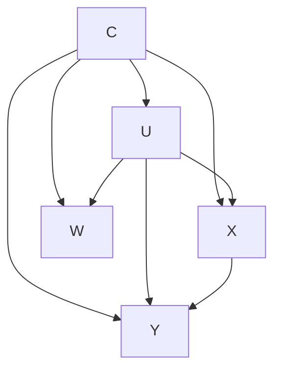

# Proxy-Variance-Anchored Single Negative Control: Internal Calibration of the Negative-Control Scale from the Proxy's Own Cross-Arm Variance Signature

Date: 2026-06-28
Status: point-ID (needs one extra stated condition). The unconditional point-identification claim is refuted by a fatal adversary counterexample. Point identification is restored only after adding an extra, untestable assumption (arm-invariant proxy-outcome noise covariance), which exactly removes the idea's headline "theorem not assumption" selling point. Absent that condition, the honest deliverable is sharp partial identification over the scale.
Rank among the 9: #3 of 9.
Mechanism family: single negative-control-outcome (NCO) proxy plus additive single-factor confounding, identified through second-moment (variance/covariance) heteroskedasticity of the latent confounder, with the identifying anchor relocated from the outcome side to the proxy side.
Tags: proximal causal inference, negative control outcome, single proxy, heteroskedasticity identification, MR MiSTERI, additive confounding, partial identification, sensitivity analysis.

## One-line idea

> Under additive single-factor confounding with one valid negative-control-outcome proxy $W$, the unknown proxy-to-outcome confounding-scale ratio is read off the proxy's own cross-arm second moments, $\rho(C) = \{\mathrm{Var}(W\mid 1,C) - \mathrm{Var}(W\mid 0,C)\} / \{\mathrm{Cov}(W,Y\mid 1,C) - \mathrm{Cov}(W,Y\mid 0,C)\}$, yielding $\theta(C) = (E[Y\mid 1,C] - E[Y\mid 0,C]) - (E[W\mid 1,C] - E[W\mid 0,C])/\rho(C)$, with no second proxy and no completeness, but only after one extra noise-coupling assumption that the original pitch wrongly claimed was free.

## Glossary

Every symbol used below is defined here before first use.

- $X$: binary treatment, $X \in \{0,1\}$.
- $Y$: scalar outcome.
- $Y(x)$: potential outcome under treatment level $x$.
- $U$: scalar unmeasured confounder summary. Never observed.
- $W$: the single proxy, a negative-control outcome (NCO) of $U$. Observed.
- $C$: observed baseline covariates.
- ATE: average treatment effect, $\theta = E[Y(1)] - E[Y(0)]$.
- $\theta(C)$: conditional average treatment effect given $C$.
- Proxy: an observed variable that is a noisy reading of $U$ but is not itself a cause of treatment or outcome.
- Negative control outcome (NCO): a proxy $W$ that is downstream of $U$ but is causally untouched by $X$, so that any observed dependence of $W$ on $X$ flows only through $U$.
- Bridge function / identifying functional: an equation that expresses the target $\theta$ purely in terms of the observed data law.
- Completeness: a statistical injectivity condition used in two-proxy proximal inference to invert an integral operator. We avoid it here.
- $\gamma$, written $\gamma(U,C)$: a scalar function of $U$ (and $C$) that enters the structural means linearly. We refer to it as the confounder signal.
- $b_Y(C)$: loading of $\gamma$ on the outcome mean.
- $b_W(C)$: loading of $\gamma$ on the proxy mean.
- $\rho(C)$: the calibration scale, $\rho(C) = b_W(C)/b_Y(C)$. With the normalization $b_Y(C)=1$, $\rho(C) = b_W(C)$.
- $\mu(x,C)$: the treatment-and-covariate part of the outcome mean, $E[Y\mid X=x,U,C] = \mu(x,C) + b_Y(C)\,\gamma$.
- $\alpha(C)$: intercept of the proxy mean, $E[W\mid U,C] = \alpha(C) + b_W(C)\,\gamma$.
- $\varepsilon_W$: idiosyncratic noise in $W$ after removing $\alpha(C) + b_W(C)\gamma$.
- $\varepsilon_Y$: idiosyncratic noise in $Y$ after removing its conditional mean.
- $\Delta\gamma(C) = E[\gamma\mid 1,C] - E[\gamma\mid 0,C]$: cross-arm confounder location shift.
- $\Delta v(C) = \mathrm{Var}(\gamma\mid 1,C) - \mathrm{Var}(\gamma\mid 0,C)$: cross-arm confounder dispersion shift.
- $a(C) = E[Y\mid 1,C] - E[Y\mid 0,C]$: observed outcome mean contrast.
- $b(C) = E[W\mid 1,C] - E[W\mid 0,C]$: observed proxy mean contrast.
- $c_W(x) = \mathrm{Cov}(\varepsilon_W, \varepsilon_Y \mid X=x, C)$: the proxy-outcome idiosyncratic noise coupling. This is the quantity the adversary weaponizes.
- DiD: difference-in-differences.
- COCA: control outcome calibration approach.
- MR MiSTERI: a Mendelian-randomization identification method that uses outcome heteroskedasticity in an auxiliary variable.

## Problem and motivation

When a confounder $U$ is unmeasured, the backdoor adjustment fails: $E[Y\mid X=1,C] - E[Y\mid X=0,C]$ mixes the true effect with confounding bias because $X$ and $Y$ share the hidden parent $U$. Standard proximal causal inference repairs this with two proxies of $U$, one on the treatment side and one on the outcome side, and inverts an integral operator under a completeness condition. The two-proxy requirement is often the binding constraint in practice, because a clean treatment-side proxy (a variable associated with $U$ but with no path to $Y$ except through $U$) is hard to find.

The single-proxy regime is the interesting frontier. With only one outcome-side proxy $W$ (an NCO), the leading existing methods (Sofer-style negative outcome control, COCA, and difference-in-differences read as equi-confounding) can only handle the location bias if they import the calibration scale, the ratio $b_W/b_Y$ of how strongly $U$ loads on the proxy versus on the outcome, from outside the observed law. They set it to $1$ (parallel trends), or take it from validation data, or from a known measurement mechanism. The gap this idea targets is the internal recovery of that scale from the observed data alone, so that no external calibration is needed.

## Setup and causal graph

Vertices: $X$ (treatment), $Y$ (outcome), $U$ (unmeasured scalar confounder), $W$ (single NCO proxy of $U$), $C$ (observed covariates).

Directed edges present: $U \to X$, $U \to Y$, $U \to W$, $X \to Y$, $C \to X$, $C \to Y$, $C \to U$, $C \to W$.

Forbidden edges, which are the structural content of the single NCO: $X \not\to W$ (treatment does not cause the proxy), $W \not\to Y$, $W \not\to X$. Equivalently $W \perp X \mid (U,C)$, and in the strong distributional reading $p(W\mid X,U,C) = p(W\mid U,C)$. There is exactly one $W$ and no treatment-side proxy $Z$.

```
        C
     /  |  \  \
    v   v   v  v
    U   X   W  (C -> U, C -> X, C -> W, C -> Y)
   /|\   \
  v v v   v
  X W Y   Y      U -> X, U -> Y, U -> W ; X -> Y
```



The graph-level idea the method tries to exploit: because $X \not\to W$, conditioning on $X$ is selection on $U$, which generically changes the dispersion of $U$ within a $C$-stratum, so $\mathrm{Var}(\gamma\mid 1,C) \neq \mathrm{Var}(\gamma\mid 0,C)$. The proposal claims this dispersion shift propagates identically into $\mathrm{Var}(W\mid X,C)$ and $\mathrm{Cov}(W,Y\mid X,C)$, so their cross-arm-difference ratio recovers the scale.

## Target estimand

The structural outcome mean is $E[Y\mid X=x,U,C] = \mu(x,C) + b_Y(C)\,\gamma(U,C)$, with $\theta(C) = \mu(1,C) - \mu(0,C)$ being the conditional effect free of $U$ because $X$ does not interact with $U$. The target is
$$\theta = E[Y(1)] - E[Y(0)] = E_C[\theta(C)].$$
When the identifying anchor is weak, $\mathrm{Var}(W\mid 1,C) \approx \mathrm{Var}(W\mid 0,C)$, the deliverable is the sharp partial-identification interval $\theta(\rho) = a(C) - b(C)/\rho$ swept over a user range of $\rho$.

## Assumptions

1. Consistency and positivity. Formal: $Y = Y(X)$ and $0 < P(X=1\mid C) < 1$ almost surely. Plain reading: the observed outcome equals the potential outcome at the realized treatment, and both arms occur in every covariate cell. Mildness: identical to two-proxy proximal, COCA, Sofer-NCO, MR MiSTERI, and DiD. Testable: positivity is testable; consistency is structural.

2. Latent ignorability. Formal: $Y(x) \perp X \mid U, C$ for all $x$. Plain reading: $(U,C)$ block every backdoor path. Mildness: this is exactly the proximal/NCO premise, no extra cost. Testable: no, $U$ is unobserved.

3. Valid single NCO, strong distributional form. Formal: $p(W\mid X,U,C) = p(W\mid U,C)$, so $W \perp X \mid (U,C)$ and $W$ causes neither $X$ nor $Y$. In particular both $b_W(C)$ and $\mathrm{Var}(\varepsilon_W\mid C)$ are arm-invariant. Plain reading: $W$ is a downstream marker of $U$ untouched by treatment, for example a pre-treatment repeated measure, an unaffected secondary outcome, or a placebo biomarker. Mildness: this is the standard NCO definition. Testable: the mean-level consequence $E[W\mid X=x, U=u, C]$ being arm-invariant is not directly testable because $U$ is hidden, but its observable shadow $W \perp X \mid (U,C)$ is the usual NCO premise.

4. Additive single-factor confounding, no $U \times X$ interaction. Formal: $E[Y\mid X=x,U,C] = \mu(x,C) + b_Y(C)\,\gamma(U,C)$ and $E[W\mid U,C] = \alpha(C) + b_W(C)\,\gamma(U,C)$, with $\mu(1,C) - \mu(0,C)$ not depending on $U$. Plain reading: the confounder shifts the mean additively and the treatment effect is homogeneous in $U$. Mildness: the same homogeneity used in DiD, Sofer-NCO, and MR MiSTERI. Testable: no.

5. Constant loadings across arms. Formal: $b_Y(C)$ and $b_W(C)$ do not depend on $x$. Plain reading: the strength with which $U$ loads on outcome and on proxy is the same in both arms. Mildness: for $b_Y$ this follows from Assumption 4, for $b_W$ from Assumption 3. Testable: no.

6. Proxy relevance. Formal: $b_W(C) \neq 0$ and $\gamma(\cdot,C)$ non-degenerate, so $\mathrm{Cov}(W,U\mid C) \neq 0$. Plain reading: $W$ actually carries information about $U$. Mildness: if it fails no method can help. Testable: a necessary shadow ($W$ associated with $X$ given $C$) is testable.

7. Treatment-induced confounder location shift. Formal: $E[\gamma\mid 1,C] \neq E[\gamma\mid 0,C]$, i.e. $\Delta\gamma(C) \neq 0$. Plain reading: there is confounding bias to correct. Mildness: if zero, naive regression is already unbiased. Testable: its shadow $b(C) = E[W\mid 1,C] - E[W\mid 0,C] \neq 0$ is testable.

8. KEY anchor, arm-varying confounder dispersion. Formal: $\mathrm{Var}(\gamma\mid 1,C) \neq \mathrm{Var}(\gamma\mid 0,C)$, operationalized as $\mathrm{Var}(W\mid 1,C) \neq \mathrm{Var}(W\mid 0,C)$. Plain reading: selection on $U$ by treatment changes the spread of $U$, not only its mean. Mildness: equal variance is the knife-edge case; confounder-driven selection generically moves the spread. Testable: the operational form $\mathrm{Var}(W\mid 1,C) \neq \mathrm{Var}(W\mid 0,C)$ is a clean function of the observed $(X,W,C)$ law.

9. Extra noise-coupling condition (NOT in the original pitch, forced by the audit). Formal: $\mathrm{Cov}(\varepsilon_W,\varepsilon_Y\mid X=1,C) = \mathrm{Cov}(\varepsilon_W,\varepsilon_Y\mid X=0,C)$, i.e. $c_W(1) = c_W(0)$. Plain reading: the coupling between the proxy's residual noise and the outcome's residual noise is the same in both arms. Mildness: this is genuinely an extra structural assumption, not implied by NCO. Testable: no, because $\varepsilon_W$ and $\varepsilon_Y$ are latent residuals after removing the unobserved $\gamma$. The original idea claimed this came for free from Assumption 3. It does not. This is the crux of the soundness audit below.

## The single mild assumption that replaces the second proxy

The intended single replacement for the second proxy was Assumption 8, the arm-varying confounder dispersion read on the proxy side. In two-proxy proximal inference the second treatment-side proxy supplies the completeness (injectivity) needed to invert the operator that maps $U$'s effect on $Y$. Here, additivity collapses that operator to a scalar per cell, and the proposal's claim is that one proxy carries two independent signatures of $U$: its mean reveals the location shift $\Delta\gamma(C)$, and its cross-arm variance reveals the scale $b_W(C)$. Assumption 8 is exactly the activation condition that makes the variance signature usable, and the original pitch is that it stands in for both completeness and the externally-supplied calibration scale of all prior single-NCO work, while staying testable.

The honest correction is that Assumption 8 alone does not close the system. Recovering $\rho(C) = b_W(C)$ from the proxy-side ratio also requires Assumption 9, which is untestable and was the hidden cost the original framing missed.

## Identification result

Normalize $b_Y(C) = 1$, which is without loss because $\theta$ is scale-invariant in the loadings. Define $\rho(C) := b_W(C)/b_Y(C) = b_W(C)$.

Claim (as originally stated, before the audit). Under Assumptions 1 through 8,
$$\rho(C) = \frac{\mathrm{Var}(W\mid X=1,C) - \mathrm{Var}(W\mid X=0,C)}{\mathrm{Cov}(W,Y\mid X=1,C) - \mathrm{Cov}(W,Y\mid X=0,C)},$$
well-defined exactly under Assumption 8 (nonzero denominator). With $a(C) = E[Y\mid 1,C] - E[Y\mid 0,C] = \theta(C) + \Delta\gamma(C)$ and $b(C) = E[W\mid 1,C] - E[W\mid 0,C] = b_W(C)\,\Delta\gamma(C)$, eliminating $\Delta\gamma$ gives the identifying functional
$$\theta(C) = a(C) - \frac{b(C)}{\rho(C)} = \big(E[Y\mid 1,C] - E[Y\mid 0,C]\big) - \big(E[W\mid 1,C] - E[W\mid 0,C]\big)\cdot \frac{\mathrm{Cov}(W,Y\mid 1,C) - \mathrm{Cov}(W,Y\mid 0,C)}{\mathrm{Var}(W\mid 1,C) - \mathrm{Var}(W\mid 0,C)},$$
and $\theta = E_C[\theta(C)]$.

Corrected claim (after the audit). The functional above equals $\theta(C)$ if and only if Assumption 9, $c_W(1) = c_W(0)$, also holds. Without Assumption 9 the same observed law is consistent with multiple values of $\theta(C)$, so the functional is not an identifying functional and the result downgrades to the sharp partial-identification interval $\theta(\rho) = a(C) - b(C)/\rho$ swept over the admissible range of $\rho$.

## Proof sketch

Set $b_Y = 1$ without loss. Work within one $C$-stratum and suppress $C$.

Step 1, means. Inputs: Assumptions 2 and 4. By latent ignorability and additivity, $E[Y\mid X=x] = \mu(x) + E[\gamma\mid x]$, so $a = \theta + \Delta\gamma$ with $\theta = \mu(1) - \mu(0) = E[Y(1) - Y(0)]$. By strong NCO (Assumption 3), $E[W\mid X=x] = \alpha + b_W E[\gamma\mid x]$, so $b = b_W \Delta\gamma$. Derived: the two first-moment equations relating observed contrasts $(a,b)$ to unknowns $(\theta, \Delta\gamma, b_W)$.

Step 2, the proxy-side anchor (this is the step the single proxy enters, and the step that fails). Inputs: Assumption 3 and the structural decomposition $W = \alpha + b_W\gamma + \varepsilon_W$, $Y = \mu(x) + \gamma + \varepsilon_Y$. By strong NCO, $\mathrm{Var}(\varepsilon_W)$ is arm-invariant. Then within arm $x$,
$$\mathrm{Var}(W\mid X=x) = b_W^2\,\mathrm{Var}(\gamma\mid x) + \mathrm{Var}(\varepsilon_W),$$
$$\mathrm{Cov}(W,Y\mid X=x) = b_W\,\mathrm{Var}(\gamma\mid x) + \mathrm{Cov}(\varepsilon_W,\varepsilon_Y\mid x) = b_W\,\mathrm{Var}(\gamma\mid x) + c_W(x).$$
The original proof asserted $c_W(x) = 0$ for all $x$, citing "$\varepsilon_W \perp \varepsilon_Y \mid C$." Differencing across arms, $\mathrm{Var}(\varepsilon_W)$ cancels, giving $\mathrm{Var}(W\mid 1) - \mathrm{Var}(W\mid 0) = b_W^2 \Delta v$, and, under the (false) $c_W \equiv 0$ claim, $\mathrm{Cov}(W,Y\mid 1) - \mathrm{Cov}(W,Y\mid 0) = b_W \Delta v$. Their ratio would be $b_W = \rho$. The actual value is
$$\rho_{\text{hat}} = \frac{b_W^2 \Delta v}{b_W \Delta v + \Delta c}, \qquad \Delta c := c_W(1) - c_W(0),$$
which equals $b_W$ only when $\Delta c = 0$, i.e. under Assumption 9. Justification of the gap: NCO constrains $p(W\mid X,U,C)$, hence the $W$-marginal noise variance $\mathrm{Var}(\varepsilon_W)$, but it says nothing about the cross-moment $\mathrm{Cov}(\varepsilon_W,\varepsilon_Y\mid x)$, which lives in the joint residual law and can be moved by treatment through $Y$'s structural equation. The proof imported clean arm-invariance of $\mathrm{Var}(\varepsilon_W)$ and illegitimately extended it to the cross-covariance.

Step 3, solve. Given $\rho = b_W$ (only valid under Assumption 9), $\Delta\gamma = b/\rho$, so $\theta = a - b/\rho$.

Step 4, target. $\theta = E_C[\theta(C)]$.

The honest conclusion is that the map from observed moments to $\theta$ is single-valued only after fixing $\Delta c = 0$. Without that, the system $\{a, b, \mathrm{Var}(W\mid x), \mathrm{Cov}(W,Y\mid x)\}$ has the extra free unknown $\Delta c$, so it does not pin $\theta$.

## Why a single proxy suffices

The intended crux: two-proxy proximal inverts an integral operator because $U$'s effect on $Y$ is an unknown function, and the second proxy supplies completeness. Additivity collapses that contamination of the $X$-contrast to a single scalar per cell, $\Delta\gamma(C)$. A scalar unknown needs one scalar equation. The crude mean contrasts $(a,b)$ give two equations for three scalars $(\theta, \Delta\gamma, b_W)$, which is why pure mean-contrast single-proxy methods must import the scale. The new observation is that one proxy already carries a second, independent signature of $U$ through its own cross-arm second moments, so its mean reveals $\Delta\gamma$ and its variance reveals $b_W$.

The corrected crux: the second signature is real but contaminated. The proxy-side variance is a clean window on $\mathrm{Var}(\gamma\mid x)$, but the proxy-outcome covariance, which the scale ratio needs in its denominator, is not clean. It carries the treatment-modulated noise coupling $c_W(x)$, which NCO does not pin. So a single proxy suffices for point identification only once the joint residual coupling is also held arm-invariant, an assumption of the same character as the outcome-noise condition the idea set out to avoid.

## Estimator

Plug-in, debiased, cross-fitted. (1) Estimate $C$-conditional first moments $m_Y^x(C), m_W^x(C)$ and proxy-side second moments $V_W^x(C) = \mathrm{Var}(W\mid x,C)$ and $\mathrm{Cov}^x(C) = \mathrm{Cov}(W,Y\mid x,C)$ by flexible regression: fit conditional means, then regress residual squares and cross-products on $C$ within arms. (2) Form $\hat\rho(C) = (V_W^1 - V_W^0)/(\mathrm{Cov}^1 - \mathrm{Cov}^0)$ and $\hat\theta(C) = (m_Y^1 - m_Y^0) - (m_W^1 - m_W^0)/\hat\rho(C)$. (3) Average, $\hat\theta = P_n \hat\theta(C)$.

Inference. $\theta(C)$ is a smooth functional of six conditional-moment nuisances. Build the efficient influence function by stacking the AIPW score for the pseudo-outcome contrast on $\tilde Y = Y - W/\rho$ with the score contributions of the second-moment nuisances entering $\rho$, where the influence function gains a $+b(C)/\rho(C)^2$ term times the $\rho$-score. Cross-fitting plus Neyman orthogonality over all six nuisances yields root-$n$, asymptotically normal, multiply-robust estimation.

Weak-anchor robustness. $\hat\rho$ is fragile when $|V_W^1 - V_W^0|$ is small, a weak-instrument analogue. Report the first-stage statistic $\mathrm{Var}(W\mid 1,C) - \mathrm{Var}(W\mid 0,C)$ and use an Anderson-Rubin-style confidence interval by inverting tests in $\rho$.

Partial identification and sensitivity. Because Assumption 9 is untestable, the recommended default is to report $\theta(\rho) = a - b/\rho$ over a user interval of $\rho > 0$, tracing the sharp partial-ID set, and to publish a sensitivity curve over plausible values of the noise-coupling shift $\Delta c$, since $\Delta c$ widens the set beyond what the variance anchor alone would suggest. The overidentification spec test the original idea proposed (compare proxy-side and outcome-side scale estimates) does not detect the failure, because the failure lives in a cross-moment that the test cannot access without assuming the very invariance being violated.

## Worked intuition

Take one $C$-stratum, $P(X=1) = 0.5$, $b_Y = 1$, and a Gaussian confounder $\gamma\mid X=x \sim \mathcal N(\mu_g(x), \mathrm{Var}_g(x))$. The treatment selects on $\gamma$, so both the mean and the spread of $\gamma$ differ across arms: say $\mu_g = (0, 1)$ and $\mathrm{Var}_g = (1, 3)$, with proxy loading $b_W = 2$, $\alpha = 0$, $\varepsilon_W \sim \mathcal N(0, 0.5)$ independent of everything, and outcome part $\mu_Y(x) = (0, 0.8)$. Then $\mathrm{Var}(W\mid 0) = 4 \cdot 1 + 0.5 = 4.5$, $\mathrm{Var}(W\mid 1) = 4 \cdot 3 + 0.5 = 12.5$, so the variance difference is $8$. The covariance difference, when $\varepsilon_W$ and $\varepsilon_Y$ are uncorrelated, is $2\cdot 3 - 2\cdot 1 = 4$. The ratio is $8/4 = 2 = b_W$, and $\theta = a - b/\rho = 1.8 - 2/2 = 0.8$, the true effect. This is the mechanism working exactly as advertised, and it builds the intuition that the proxy's spread is a second window on $U$. The next section shows that this very example has an evil twin with the same observed law and a different $\theta$.

## Soundness audit

The adversary supplies a decisive counterexample, verified by an 8M-sample simulation, with both models written as explicit structural causal models in one $C$-stratum, $b_Y = 1$. Both share the observed law of $(X,W,Y)$: $P(X=1) = 0.5$; $E[Y\mid 0] = 0$, $E[Y\mid 1] = 1.8$; $E[W\mid 0] = 0$, $E[W\mid 1] = 2$; $\mathrm{Var}(W\mid 0) = 4.5$, $\mathrm{Var}(W\mid 1) = 12.5$; $\mathrm{Cov}(W,Y\mid 0) = 2$, $\mathrm{Cov}(W,Y\mid 1) = 6$.

Model M1 (clean, $c_W = 0$): $b_W = 2$, $\alpha = 0$; $\gamma\mid X=x \sim \mathcal N(\mu_g, \mathrm{Var}_g)$ with $\mu_g = (0,1)$, $\mathrm{Var}_g = (1,3)$; $\varepsilon_W \sim \mathcal N(0, 0.5)$ independent of $\gamma$; $\varepsilon_Y \sim \mathcal N(0,2)$ independent of $\varepsilon_W$; $\mu_Y(x) = (0, 0.8)$. True effect $\theta_1 = 0.8$.

Model M2 (admissible, arm-varying noise coupling): $b_W = 1$, $\alpha = 0$; $\gamma\mid X=x \sim \mathcal N(\mu_g, \mathrm{Var}_g)$ with $\mu_g = (0,2)$, $\mathrm{Var}_g = (1,9)$; $\varepsilon_W \sim \mathcal N(0, 3.5)$ independent of $\gamma$ and, given $\gamma$, independent of $X$, so $W = \gamma + \varepsilon_W$ with an arm-invariant proxy law and $p(W\mid X,U) = p(W\mid U)$ holds exactly; $\varepsilon_Y = \lambda(x)\varepsilon_W + \nu$ with $\nu \sim \mathcal N(0,2)$ independent of $\varepsilon_W$ and $\lambda(x) = c_W(x)/3.5$ with $c_W = (1, -3)$; $\mu_Y(x) = (0, -0.2)$. True effect $\theta_2 = -0.2$.

Both models satisfy every stated assumption 1 through 8: consistency and positivity, latent ignorability $Y(x) \perp X\mid (U,C)$, additive single-factor confounding with no $U\times X$ interaction, constant loadings, proxy relevance ($b_W \neq 0$), treatment-induced location shift ($\Delta\gamma \neq 0$), and the KEY arm-varying dispersion, which is strictly testable-positive since $\mathrm{Var}(W\mid 1) - \mathrm{Var}(W\mid 0) = 8 \neq 0$. The simulation confirms strong NCO holds in M2: conditioning on $\gamma \approx 0$, the proxy has $E[W] \approx 0$ and $\mathrm{Var}(W) \approx 3.52$ in both arms, identical, so $p(W\mid X,U) = p(W\mid U)$ genuinely holds despite $c_W(x)$ varying.

The estimator returns $\hat\rho = 2.00$ and $\hat\theta = 0.80$ for both models (simulated $\hat\theta = 0.799$ for each), yet the true effects are $0.8$ and $-0.2$. Identification fails: the observed law does not determine $\theta$ within the stated class. Severity: fatal.

Root cause. The load-bearing error is the headline that "NCO validity forces the proxy's noise law to be arm-invariant, so constant-noise is a theorem not an assumption." NCO forces $\mathrm{Var}(\varepsilon_W)$ to be arm-invariant, and that term does cancel in the variance difference. But $\mathrm{Cov}(W,Y\mid x)$ depends on the cross-moment $\mathrm{Cov}(\varepsilon_W,\varepsilon_Y\mid x) = c_W(x)$, which is not a feature of $p(W\mid U,C)$ and is not protected by NCO. Because $X \to Y$ is present, treatment can modulate the $\varepsilon_W$-$\varepsilon_Y$ coupling through $Y$'s equation while leaving $p(W\mid U,C)$ untouched. With $\Delta c = c_W(1) - c_W(0) \neq 0$, the anchor returns $\rho_{\text{hat}} = b_W^2\Delta v/(b_W\Delta v + \Delta c) \neq b_W$. So the outcome-side contamination of MR MiSTERI has an exact proxy-side analogue: treatment-induced heteroskedasticity of the proxy-outcome noise coupling. The method did not escape the untestable-noise problem, it relocated it to a cross-moment.

## Honest status and the fix

Final status: point-ID (needs one extra stated condition). The unconditional point-identification claim is false. There are two honest repair paths.

Path (a), keep point identification at a cost. Add Assumption 9 explicitly, $c_W(1) = c_W(0)$, arm-invariant proxy-outcome idiosyncratic-noise coupling. This restores $\rho(C) = b_W(C)$ and the functional $\theta(C) = a(C) - b(C)/\rho(C)$. But this is exactly the kind of untestable constant-noise restriction the idea claimed to eliminate. M2 satisfies NCO yet violates it, so it is not implied by NCO, and it is not a clean $(X,W,Y)$-functional one can test, because $\varepsilon_W$ and $\varepsilon_Y$ are latent residuals after removing the unobserved $\gamma$. A sufficient stronger version is to assume $\varepsilon_W$ jointly independent of $(X, \varepsilon_Y)$ given $(U,C)$, which kills $c_W(x)$ entirely, but this is a genuine extra structural assumption on the joint residual law, restoring a noise condition of the same character as MR MiSTERI's.

Path (b), drop to sharp partial identification. Report $\theta(\rho) = a(C) - b(C)/\rho$ over a range of $\rho$ that now must also account for the uncertainty in $c_W(x)$. The interval is wider than the original pitch advertised, because the proxy-variance anchor no longer pins $\rho$.

The overidentification spec test the idea proposed does not detect this failure: in M2 both the proxy-side and outcome-side routes can be made to agree on the wrong scale, and the test cannot even run without assuming the very noise-invariance being violated.

This idea should be presented as a cautionary mechanism with a real but smaller contribution. The novelty of relocating the variance anchor from the outcome side to the proxy side is genuine. The error is the claim that relocation makes the noise condition free. The sibling salvage is the partial-identification framing in Path (b), combined with an explicit, clearly-labelled sensitivity analysis over $\Delta c$.

## Novelty vs prior work

Closest prior work: Liu, Ye, Sun and Tchetgen Tchetgen (2023), "MR MiSTERI." MR MiSTERI identifies an effect under unmeasured confounding from one auxiliary variable via three ingredients: an additive effect not varying with the auxiliary, confounding not varying with it, and outcome residual variance that is heteroskedastic in the auxiliary. The intended delta of this idea is the load-bearing place of the anchor: MR MiSTERI uses outcome heteroskedasticity, which requires an untestable no-treatment-on-outcome-variance restriction when the stratifier is the endogenous treatment, whereas this idea uses the proxy's own variance.

The honest delta after the audit. The relocation of the anchor from the outcome side to the proxy side is the real and defensible novelty. The claimed further delta, that relocation converts the noise condition from an assumption into a theorem, is false. The proxy-side construction needs Assumption 9, which is an untestable noise-coupling condition of the same character as MR MiSTERI's outcome-noise condition. So the increment over MR MiSTERI is the change of which variable carries the heteroskedasticity signature, plus a built-in partial-identification fallback, not an escape from untestable noise restrictions.

## AISTATS significance and positioning

The contribution worth publishing is a precise structural lesson: relocating a heteroskedasticity-identification anchor onto a negative-control proxy moves the contamination from the outcome marginal variance to the proxy-outcome cross-covariance, but does not remove it, because NCO validity constrains the proxy marginal law and not the joint residual coupling. This is a clean and transferable insight for the proximal and heteroskedasticity-ID communities, and the explicit counterexample makes it rigorous. Positioned as point identification under one extra stated noise assumption, with a sharp partial-ID fallback and a sensitivity analysis over the noise-coupling shift, the work is honest and useful. Positioned as the original "theorem not assumption" claim, it would be refuted on first review by exactly the M1/M2 pair above.

## Open problems and next steps

1. Characterize the sharp partial-ID set for $\theta(C)$ as a function of bounds on $\Delta c = c_W(1) - c_W(0)$, and find the tightest interval implied by additional observed-law constraints.
2. Search for any observed-law functional that is sensitive to $\Delta c$, to test whether the failure is detectable in special parametric families (for instance with higher moments of $W$ and $Y$ jointly), even if not in the second moments alone.
3. Identify domain settings where a substantive argument bounds $\Delta c$ near zero, for example pre-treatment proxies measured before the outcome's noise channel can be modulated by treatment.
4. Compare the partial-ID width of this proxy-side approach against MR MiSTERI's outcome-side intervals under matched signal strength.
5. Develop the efficient influence function and weak-anchor (Anderson-Rubin) inference for the partial-ID version, where $\rho$ is set-valued.

## References

- Liu, Ye, Sun and Tchetgen Tchetgen (2023). MR MiSTERI: Mendelian Randomization Mixed-Scale Treatment Effect Robust Identification. Biometrics; arXiv:2009.14484.
- Lewbel (2012). Using Heteroscedasticity to Identify and Estimate Mismeasured and Endogenous Regressor Models. Journal of Business and Economic Statistics.
- Tchetgen Tchetgen, Sun and Walter (2021). The GENIUS Approach to Robust Mendelian Randomization. Journal of the Royal Statistical Society Series B.
- Sofer, Richardson, Colicino, Schwartz and Tchetgen Tchetgen (2016). On Negative Outcome Control as a Generalization of Difference-in-Differences. Statistical Science.
- Tchetgen Tchetgen (2014). Control Outcome Calibration Approach (COCA). American Journal of Epidemiology.
- Kuroki and Pearl (2014). Measurement Bias and Effect Restoration. Biometrika.
- Park, Richardson and Tchetgen Tchetgen (2024). Single Proxy Control. Biometrics.
- Miao, Geng and Tchetgen Tchetgen (2018). Identifying Causal Effects with Proxy Variables of an Unmeasured Confounder. Biometrika.
- Cui, Pu, Shi, Miao and Tchetgen Tchetgen (2024). Semiparametric Proximal Causal Inference. Journal of the Royal Statistical Society Series B.
- Klein and Vella, and related work on Estimation of Treatment Effects under Endogenous Heteroskedasticity. arXiv:1803.06557.
